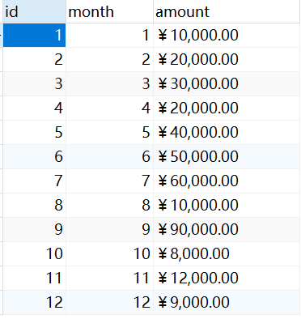
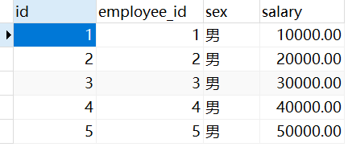

## `CASE`表达式

### 将已有列转换为其它列并进行统计

现有月度销售额数据表，如下：



需要统计季度销售额数据，可以使用`CASE`表达式，将月度转换为季度，然后进行分组统计。标准sql如下：

```sql
SELECT (CASE WHEN "month" <= 3 THEN '一季度' 
             WHEN "month" <= 6 THEN '二季度'
             WHEN "month" <= 9 THEN '三季度'
             WHEN "month" <= 12 THEN '四季度'
             ELSE '其它'
	    END) AS season,
        sum(amount) AS amount
FROM t_sales_amount
GROUP BY (CASE WHEN "month" <= 3 THEN '一季度' 
               WHEN "month" <= 6 THEN '二季度'
               WHEN "month" <= 9 THEN '三季度'
               WHEN "month" <= 12 THEN '四季度'
               ELSE '其它'
          END)
```

在MySQL或PostgreSQL中，支持下面的简写方式：

```sql
SELECT (CASE WHEN "month" <= 3 THEN '一季度' 
             WHEN "month" <= 6 THEN '二季度'
             WHEN "month" <= 9 THEN '三季度'
             WHEN "month" <= 12 THEN '四季度'
             ELSE '其它'
       END) AS season,
       sum(amount) AS amount
FROM t_sales_amount
GROUP BY season
```

输出：


### 在1条sql中按照不同条件进行统计

现有各个省份的男女人口数据表，如下：


需要将各个省份的男女人口数据"行转列"，可以使用`CASE`表达式，sql如下：

```sql
SELECT province,
       sum(CASE sex WHEN '男' THEN population ELSE 0 END) AS population_male,
	   sum(CASE sex WHEN '女' THEN population ELSE 0 END) AS population_female
FROM t_population
GROUP BY province
```

输出：


### 在`CHECK`约束中定义多个列的条件关系

现有员工薪资表，要求限制女性员工的薪资不得超过20000元，可以给给性别列和薪资列添加`CHECK`约束，sql如下：

```sql
ALTER TABLE t_salary
ADD CONSTRAINT salary_check
CHECK((CASE WHEN sex = '女' AND salary >= 20000 THEN 0 ELSE 1 END) = 1)
```

### 在`UPDATE`语句中使用`CASE`表达式

现有员工薪资表，如下：



需要调整薪资：

- 薪资大于40000的员工，统一下调薪资10%
- 薪资小于20000的员工，统一上调薪资10%
- 其它员工薪资保持不变

使用`CASE`表达式，sql如下：

```sql
UPDATE t_salary
SET salary = (CASE WHEN salary > 40000 THEN salary * 0.9 WHEN salary < 20000 THEN salary * 1.1 ELSE salary END)
```

结果：


