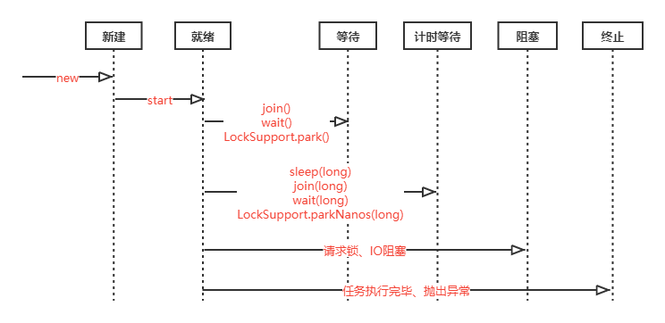

## 线程名称

可以在创建线程时，使用构造器参数设置线程的名称，或者在线程创建后，使用`setName(String)`方法设置；不设置时，会有默认的名称。

获取线程的名称，可以使用`getName()`方法。

示例：

```java
Runnable task = () -> {
    Thread currentThread = Thread.currentThread();
    System.out.println(currentThread.getName());
};
Thread t= new Thread(task, "线程A");
t.start();
```

## 线程优先级

线程的调度模型主要有2类：

- 分时调度模型，所有线程轮流占用CPU时间片
- 抢占式调度模型，按照线程的优先级分配CPU时间片。理论上说，优先级越高的线程，获得CPU时间片的机会越大。

Java线程的管理与调度是委托给操作系统的，目前，大部分操作系统均使用抢占式调度模型。

线程优先级从低到高为1-10，`Thread`类中定义了几个常量字段

```java
public static final int MIN_PRIORITY = 1;
public static final int NORM_PRIORITY = 5;
public static final int MAX_PRIORITY = 10;
```

线程优先级相关API如下：

- `Thread#setPriority(int)`，设置优先级
- `Thread#getPriority()`，获取优先级

示例：

```java
private final ThreadLocal<Integer> count = ThreadLocal.withInitial(() -> 0);

private void foo(){
    AtomicInteger maxCount = new AtomicInteger(10000);
    Runnable task = () -> {
        while(maxCount.getAndDecrement() > 0){
            count.set(count.get() + 1);
            System.out.printf("%s: %d%n", Thread.currentThread().getName(), count.get());
        }
    };
    Thread t1 = new Thread(task, "线程A");
    t1.setPriority(Thread.MAX_PRIORITY);

    Thread t2 = new Thread(task, "线程B");
    t2.setPriority(Thread.NORM_PRIORITY);

    Thread t3 = new Thread(task, "线程C");
    t2.setPriority(Thread.MIN_PRIORITY);

    t1.start();
    t2.start();
    t3.start();
}
```

## 守护线程

Java线程分为用户线程（User Thread）和守护线程（Daemon Thread）2种，所有用户线程退出后，守护线程随着JVM一起退出。

`Thread#setDaemon()`方法设置线程是否为守护线程，`Thread#isDaemon()`返回线程是否为守护线程。

## 线程休眠

调用`Thread#sleep()`静态方法，可以让当前线程暂停指定的时间

```java
try {
    Thread.sleep(1000L); // 1000ms
    Thread.sleep(1000L,5000); // 1000ms + 5000ns
} catch (InterruptedException e) {
    e.printStackTrace();
}
```

或者，使用`TimeUnit`中几个内部类的`sleep()`方法

```java
try {
    TimeUnit.MILLISECONDS.sleep(1000L);
    TimeUnit.SECONDS.sleep(1L);
    TimeUnit.MINUTES.sleep(1L);
} catch(InterruptedException e) {
    e.printStackTrace();
}
```

## 线程中断

`Thread#stop()`方法用于停止线程；

`Thread#interrupt()`方法用于中断线程

## 线程让步

`Thread#yield`静态方法，告诉线程调度器，当前线程暂时放弃对CPU的占用。结果不可预测。

## 线程合并

`Thread#join`方法，将另一个线程合并到当前线程中，先执行合并进来的线程，再继续执行当前线程。

## 线程生命周期

Java线程有6种状态

```java
public enum State {
    NEW,
    RUNNABLE,
    BLOCKED,
    WAITING,
    TIMED_WAITING,
    TERMINATED;
}
```

时序图如下：


