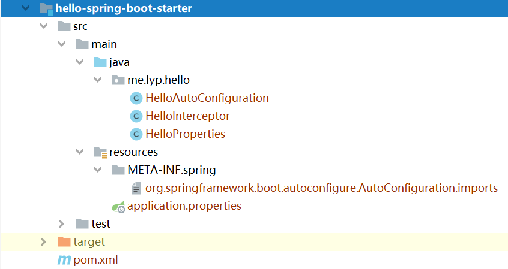

starter本质上是一个包含依赖库, 自动配置类, 以及定制特定功能的基础代码的maven或gradle项目.

starter命名规范:

- Spring官方starter: `spring-boot-starter-*`, 例如 `spring-boot-starter-data-jpa`
- 非Spring官方starter: `*.spring-boot-starter`, 例如 `mybatis-spring-boot-starter`

## 自定义Starter

参考: https://docs.spring.io/spring-boot/docs/current/reference/html/features.html#features.developing-auto-configuration

以一个最简单的例子说明如何自定义starter: 添加1个拦截器, 如果请求的url为 */hello*, 则返回问候语.

项目目录结构



### 1.创建starter项目

1.1 starter项目名称为: *hello-spring-boot-starter*

1.2 添加依赖

添加starter中需要用到的依赖, 其中, `spring-boot-autoconfigure-processor` 是必要的, 其它按需添加

```xml
<?xml version="1.0" encoding="UTF-8"?>
<project xmlns="http://maven.apache.org/POM/4.0.0"
         xmlns:xsi="http://www.w3.org/2001/XMLSchema-instance"
         xsi:schemaLocation="http://maven.apache.org/POM/4.0.0 http://maven.apache.org/xsd/maven-4.0.0.xsd">
    <modelVersion>4.0.0</modelVersion>

    <groupId>me.lyp</groupId>
    <artifactId>hello-spring-boot-starter</artifactId>
    <version>1.0</version>

    <properties>
        <maven.compiler.source>17</maven.compiler.source>
        <maven.compiler.target>17</maven.compiler.target>
        <spring-boot.version>3.2.3</spring-boot.version>
    </properties>

    <dependencies>
        <dependency>
            <groupId>org.springframework.boot</groupId>
            <artifactId>spring-boot-autoconfigure-processor</artifactId>
            <version>${spring-boot.version}</version>
            <optional>true</optional>
        </dependency>

        <dependency>
            <groupId>org.springframework.boot</groupId>
            <artifactId>spring-boot-starter-web</artifactId>
            <version>${spring-boot.version}</version>
        </dependency>
    </dependencies>
</project>
```

### 2.创建自动配置类

创建自动配置类:

- 使用`@AutoConfiguration`注解, 实现自动配置, 它本身是使用 `@Configuration(proxyBeanMethods = false)` 注解的
- 使用`@Conditional`注解的派生注解, 限制自动配置在何时生效

另外, 可以在`@AutoConfiguration`注解中, 使用`after`和`before`属性, 设置其相对于另一个自动配置类的加载顺序. 

也可以使用等价的注解`@AutoConfigureBefore`和`@AutoConfigureAfter`代替`@AutoConfiguration`.

还可以使用`@AutoConfigureOrder`来设置自动配置类Bean的顺序, 类似于`@Order`注解.

这里, 创建自动配置类, 其在配置属性`hello.enabled=true`时生效

```java
@AutoConfiguration(after = { WebMvcAutoConfiguration.class })
@AutoConfigureOrder(value = 0)
@ConditionalOnProperty(prefix = "hello", name = "enabled", havingValue = "true", matchIfMissing = false)
public class HelloAutoConfiguration {
    
}
```

### 3.创建自动配置类的定位文件

自动配置类要想在Spring Boot启动时被检查到, 需要提供一个自动配置类的候选项文件:

在springboot v2中, 需要在 *META-INF/spring.factories* 文件中, 列出自动配置类, 例如

```
# 自动配置类, 多个类用逗号隔开
org.springframework.boot.autoconfigure.EnableAutoConfiguration=me.lyp.hello.XAutoConfiguration, me.lyp.hello.YAutoConfiguration
```

在springboot v3中, 需要在 *META-INF/spring/org.springframework.boot.autoconfigure.AutoConfiguration.imports* 文件中, 列出自动配置类, 例如:

```
# 自动配置类, 每个类单独占1行
me.lyp.hello.HelloAutoConfiguration
```

### 4.定义属性配置类

这里, 只定义了2个属性

```java
@ConfigurationProperties(prefix = "hello")
public class HelloProperties {
    /**
     * 是否启用Starter
     * */
    private Boolean enabled;

    /**
     * 问候语
     * */
    private String greetings;

	// getters/setters
}
```

### 5.编写定制特定功能的基础代码

这里, 定义1个拦截器.

如果请求URL为 */hello*, 且配置属性 `hello.enabled=true`, 则返回问候语, 默认是"hello"

```java
public class HelloInterceptor implements HandlerInterceptor {
    private static final String DEFAULT_GREETINGS = "hello";

    private final HelloProperties helloProperties;

    public HelloInterceptor(HelloProperties helloProperties) {
        this.helloProperties = helloProperties;
    }

    @Override
    public boolean preHandle(HttpServletRequest request, HttpServletResponse response, Object handler) throws Exception {
        Boolean enabled = helloProperties.getEnabled();
        String greetings = helloProperties.getGreetings();

        if(enabled != null && enabled){
            String url = request.getRequestURI();
            if("/hello".equals(url)){
                PrintWriter writer = response.getWriter();
                if(greetings == null || greetings.isBlank()){
                    greetings = DEFAULT_GREETINGS;
                }
                writer.println(greetings);
                writer.close();
                return false;
            }
        }
        return true;
    }
}
```

注册拦截器

```java
@AutoConfiguration(after = { WebMvcAutoConfiguration.class })
@AutoConfigureOrder(value = 0)
@ConditionalOnProperty(prefix = "hello", name = "enabled", havingValue = "true", matchIfMissing = false)
public class HelloAutoConfiguration {

    @Configuration(proxyBeanMethods = false)
    @EnableConfigurationProperties({ HelloProperties.class })
    public static class HelloWebMvnConfiguration implements WebMvcConfigurer{
        private final HelloProperties helloProperties;

        public HelloWebMvnConfiguration(HelloProperties helloProperties) {
            this.helloProperties = helloProperties;
        }

        @Override
        public void addInterceptors(InterceptorRegistry registry) {
            registry.addInterceptor(new HelloInterceptor(helloProperties));
        }
    }
}
```

### 6.验证

新建maven项目, 添加自定义的`hello-spring-boot-starter`依赖

```xml
<dependency>
    <groupId>me.lyp</groupId>
    <artifactId>hello-spring-boot-starter</artifactId>
    <version>1.0</version>
</dependency>
```

创建springboot启动引导类

```java
@SpringBootApplication
public class HelloStarterTestApp {
    public static void main(String[] args) {
        SpringApplication.run(HelloStarterTestApp.class, args);
    }
}
```

创建appication.properties配置文件

```java
hello.enabled=false
hello.greetings=hi
```

启动App, 访问: http://localhost:8080/hello, 

- `hello.enabled=false`, starter未启用, 返回404页面
- `hello.enabled=true`, starter启用, 返回"hi"

