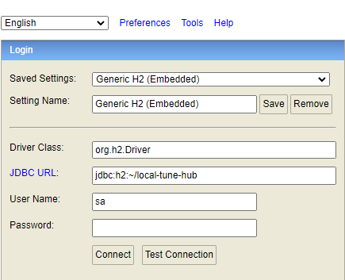

http://www.h2database.com/html/quickstart.html

## 快速开始

添加依赖

```xml
<dependency>
    <groupId>com.h2database</groupId>
    <artifactId>h2</artifactId>
    <version>2.2.224</version>
    <scope>runtime</scope>
</dependency>
<!--ORM框架-->
<dependency>
    <groupId>org.mybatis.spring.boot</groupId>
    <artifactId>mybatis-spring-boot-starter</artifactId>
    <version>3.0.3</version>
</dependency>
```

配置

```properties
spring.datasource.driver-class-name=org.h2.Driver
spring.datasource.url=jdbc:h2:file:~/local-tune-hub;DB_CLOSE_DELAY=-1;DB_CLOSE_ON_EXIT=TRUE;AUTO_RECONNECT=TRUE;MODE=MySQL;DATABASE_TO_LOWER=TRUE
spring.datasource.username=sa
spring.datasource.password=

spring.h2.console.enabled=true
spring.h2.console.path=/h2-console
#spring.h2.console.settings.web-admin-password=
spring.h2.console.settings.trace=false
spring.h2.console.settings.web-allow-others=false

# ORM框架配置
```

访问H2控制台

启动Spring应用，访问 http://localhost:8080/h2-console

