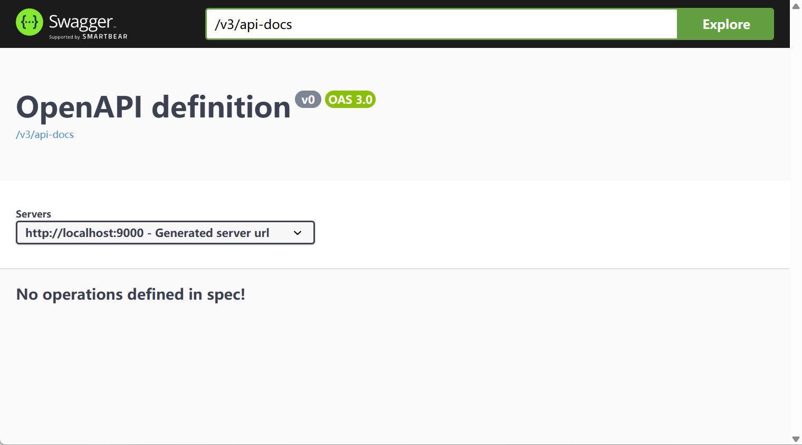
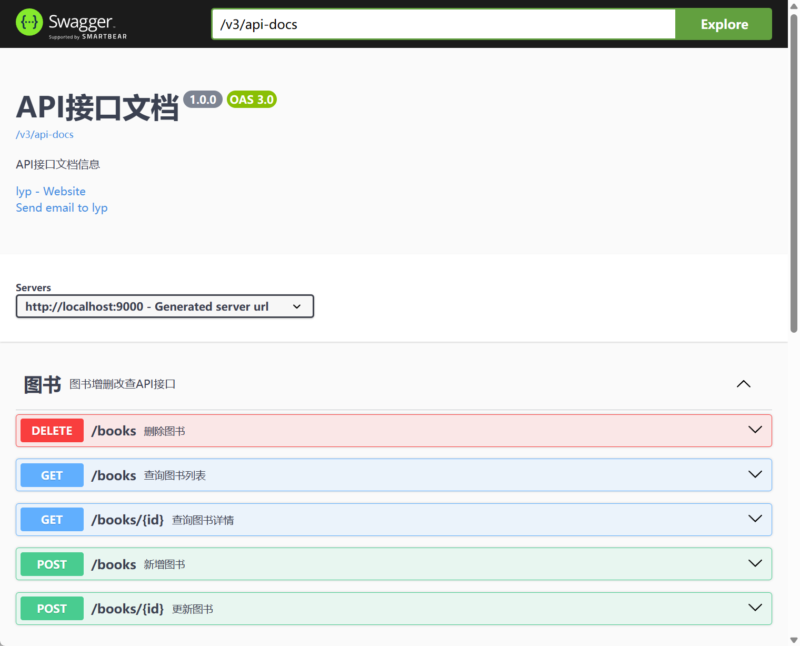

## SpringBoot2集成Swagger3

官方文档：https://springdoc.org/v1/

springdoc-openapi v1.8.0是最后一个支持springboot 1.x和2.x的版本。

1.添加依赖

```xml
<dependency>
    <groupId>org.springdoc</groupId>
    <artifactId>springdoc-openapi-ui</artifactId>
    <version>1.8.0</version>
</dependency>
```

2.创建配置类

```java
@Configuration
public class SwaggerConfiguration {
	
    // 配置文档基本信息
    @Bean
    public OpenAPI openAPI() {
        Contact contact = new Contact().name("xxx").email("xxx@gmail.com").url("https://xxx.github.io");
        License license = new License().name("Apache License 2.0").url("https://www.apache.org/licenses/LICENSE-2.0");
        Info info = new Info().title("API接口文档")
                .summary("API接口文档")
                .description("API接口文档")
                .version("1.0")
                .contact(contact)
                .license(license);
        return new OpenAPI(SpecVersion.V31)
                .info(info);
    }
    
    // API分组
    @Bean
    public GroupedOpenApi sysApi(){
        return GroupedOpenApi.builder()
                .group("public")
            	.displayName("公开接口")
                .pathsToMatch("/api/v1/public/**")
                .build();
    }

    @Bean
    public GroupedOpenApi sysApi(){
        return GroupedOpenApi.builder()
                .group("admin")
            	.displayName("后台接口")
                .pathsToMatch("/api/v1/admin/**")
                .build();
    }
}
```

3.访问接口文档

http://localhost:8080/swagger-ui.html

## SpringBoot3集成springdoc-openapi

官方文档：https://springdoc.org/

### 添加依赖

添加`springdoc-openapi-starter-webmvc-ui`依赖，包含了`swagger-ui`

```xml
<!-- https://mvnrepository.com/artifact/org.springdoc/springdoc-openapi-starter-webmvc-ui -->
<dependency>
    <groupId>org.springdoc</groupId>
    <artifactId>springdoc-openapi-starter-webmvc-ui</artifactId>
    <version>2.3.0</version>
</dependency>
```

访问swagger-ui页面：http://server:port/context-path/swagger-ui.html



访问OpenAPI Json数据：http://server:port/context-path/v3/api-docs

```json
{
    "openapi": "3.0.1",
    "info": {
        "title": "OpenAPI definition",
        "version": "v0"
    },
    "servers": [
        {
            "url": "http://localhost:9000",
            "description": "Generated server url"
        }
    ],
    "paths": {},
    "components": {}
}
```

### 核心配置

#### OpenAPI

```properties
springdoc.api-docs.enabled=true
springdoc.api-docs.path=/v3/api-docs
springdoc.packages-to-scan=me.lyp.integration.swagger.controller
springdoc.packages-to-exclude=
```

#### swagger-ui 

```properties
springdoc.swagger-ui.enabled=true
springdoc.swagger-ui.path=/swagger-ui.html
```

### 使用OpenApi注解生成文档信息

#### 配置文档基本信息

使用`@OpenAPIDefinition`注解配置文档基本信息

```java
@Configuration
@OpenAPIDefinition(
        info = @Info(title = "Blog API接口文档", description = "Blog API接口文档",
                license = @License(name = "Private", url = ""), contact = @Contact, version = "1.0"),
        tags = {},
        servers = {@Server(url = "http://localhost:8090", description = "开发环境服务器")}
)
public class SwaggerConfiguration {

}
```

#### 配置API接口信息

配置API接口信息，常用的几个注解如下：

- `@Schema`
- `@Tags`和`@Tag`
- `@Operation`
- `@Header`
- `@Parameters` 和 `@Parameter`
- `@RequestBody`
- `@ApiResponses`和`@ApiResponse`

推荐在controller附近创建package，为每个Controller定义API接口，用OpenApi注解标记API接口，而不是Controller类，实现文档信息的分离。

例如：

*IBookController.java*

```java
package me.ian.xxx.controller.api;

@Tag(name = "图书", description = "图书增删改查API接口")
public interface IBookApi {
    @Operation(tags = {"图书"}, summary = "新增图书", description = "新增图书接口")
    @RequestBody(content = @Content(mediaType = MediaType.APPLICATION_JSON_VALUE, schema = @Schema(implementation = Book.class)), description = "新增图书请求体")
    @ApiResponse(content = @Content(mediaType = MediaType.APPLICATION_JSON_VALUE, schema = @Schema(implementation = BookVO.class)), description = "新增图书响应体")
    BookVO addBook(Book book);

    @Operation(tags = {"图书"}, summary = "更新图书", description = "更新图书API接口")
    @RequestBody(content = @Content(mediaType = MediaType.APPLICATION_JSON_VALUE, schema = @Schema(implementation = Book.class)), description = "更新图书请求体")
    @ApiResponse(content = @Content(mediaType = MediaType.APPLICATION_JSON_VALUE, schema = @Schema(implementation = BookVO.class)), description = "更新图书响应体")
    BookVO updateBook(Long id, Book book);

    @Operation(tags = {"图书"}, summary = "删除图书", description = "删除图书API接口")
    @Parameters({@Parameter(name = "ids", description = "图书ID列表", schema = @Schema(implementation = List.class), required = true)})
    @ApiResponse(content = @Content(schema = @Schema(implementation = Void.class)))
    void deleteBooks(List<Long> ids);

    @Operation(tags = "图书", summary = "查询图书详情", description = "查询图书详情接口")
    @ApiResponse(content = @Content(mediaType = MediaType.APPLICATION_JSON_VALUE, schema = @Schema(implementation = BookVO.class)))
    BookVO getBook(Long id);

    @Operation(tags = "图书", summary = "查询图书列表", description = "查询图书列表接口")
    @Parameters({@Parameter(name = "name", description = "图书名称"), @Parameter(name = "price", description = "图书价格")})
    @ApiResponse(content = @Content(schema = @Schema(implementation = List.class)), description = "返回图书列表")
    List<BookVO> getBooks(Book book);
}
```

效果：



## 集成knife4j

