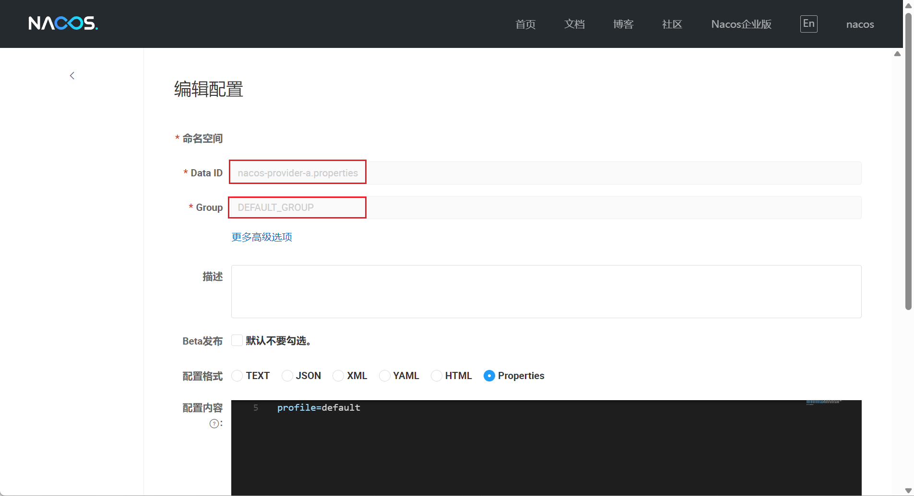
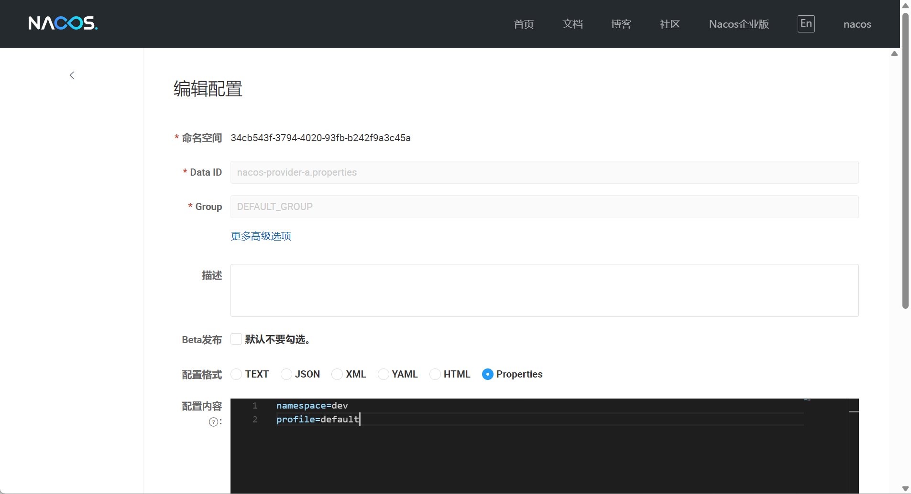
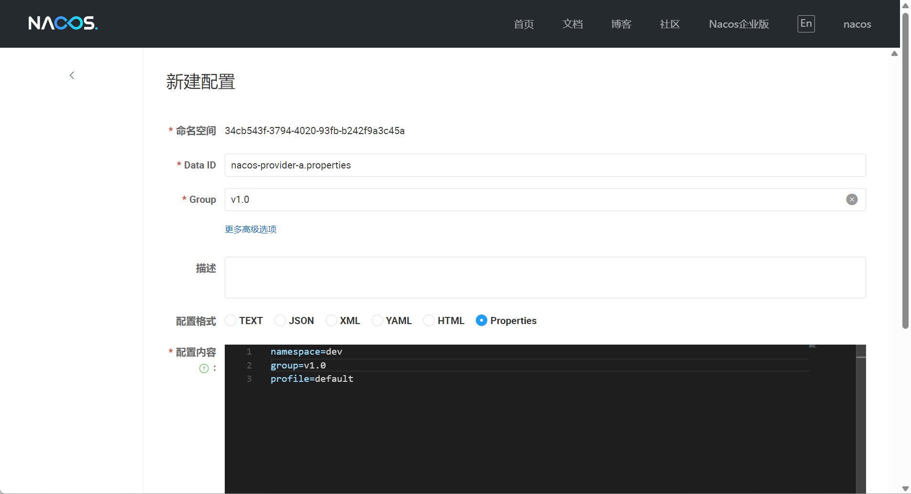

参考：

- https://sca.aliyun.com/zh-cn/docs/next/user-guide/nacos/quick-start
- https://sca.aliyun.com/zh-cn/docs/next/user-guide/nacos/advanced-guide

版本信息：

- nacos 2.2.3
- Spring Cloud Alibaba 2022.0.0.0

## 快速开始

### 添加依赖

```xml
<dependency>
    <groupId>com.alibaba.cloud</groupId>
    <artifactId>spring-cloud-starter-alibaba-nacos-config</artifactId>
</dependency>
```

### 配置

在application配置文件中，添加配置：

- 必要配置：应用名和端口
- Nacos配置中心相关配置：Nacos地址、用户名、密码
- 远程配置：使用`spring.config.import`导入nacos中创建的配置文件

```properties
server.port=9001
spring.application.name=nacos-provider-a

spring.cloud.nacos.server-addr=127.0.0.1:8848
spring.cloud.nacos.username=nacos
spring.cloud.nacos.password=nacos

spring.cloud.nacos.config.server-addr=${spring.cloud.nacos.server-addr}
spring.cloud.nacos.config.username=${spring.cloud.nacos.username}
spring.cloud.nacos.config.password=${spring.cloud.nacos.password}

spring.config.import[0]=nacos:nacos-provider-a.properties
```

在nacos控制面板中创建配置



### 验证

使用`@Value`注入nacos中定义的配置项

```java
    @Value("${profile}")
    private String profile;

    @GetMapping("/profile")
    public String profile(){
        return profile;
    }
```

请求接口：http://localhost:9001/provider-a/profile，成功读取到远程配置profile的值default

## 使用bootstrap配置文件

导入Nacos远程配置，除了上面使用的`spring.config.import`，还可以使用 *bootstrap* 文件。二者只能2选1。

**1. 添加`spring-cloud-starter-bootstrap`依赖**

```xml
<dependency>
    <groupId>org.springframework.cloud</groupId>
    <artifactId>spring-cloud-starter-bootstrap</artifactId>
</dependency>
```

**2. 创建bootstrap配置文件**

*bootstrap.properties*

```properties
server.port=9001
spring.application.name=nacos-provider-a

spring.cloud.nacos.server-addr=127.0.0.1:8848
spring.cloud.nacos.username=nacos
spring.cloud.nacos.password=nacos

spring.cloud.nacos.config.server-addr=${spring.cloud.nacos.server-addr}
spring.cloud.nacos.config.username=${spring.cloud.nacos.username}
spring.cloud.nacos.config.password=${spring.cloud.nacos.password}

spring.cloud.nacos.config.file-extension=properties
spring.cloud.nacos.config.name=${spring.application.name}

```

## 使用Profile

Nacos支持使用`spring.profiles.active`指定生效的配置文件。

**1. 在Nacos控制台中新增2个配置文件**

- Data ID为 *nacos-provider-a.dev.properties*

    ```properties
    profile=dev
    ```

- Data ID为 *nacos-provider-a.prod.properties*

    ```properties
    profile=prod
    ```

**2.1 对于`spring.config.import`的配置方式**

- 修改application配置文件，使用`spring.profiles.active`指定生效的配置

  ```properties
  spring.profiles.active=dev
  ```

- 使用`spring.config.import`指定每个Profile的远程配置文件名称(使用optional开头的import，表示文件不存在时，直接忽略该配置而不报错)

  ```properties
  spring.cloud.nacos.config.file-extension=properties
  
  spring.config.import[0]=nacos:${spring.application.name}.${spring.cloud.nacos.config.file-extension}
  spring.config.import[1]=optional:nacos:${spring.application.name}-${spring.profiles.active}.${spring.cloud.nacos.config.file-extension}
  ```

**2.2 对于bootstrap文件的配置方式**

只需要使用`spring.profiles.active`指定生效的配置即可。

**3. 验证**

`spring.profiles.active`值为null、default、dev、prod时，接口 http://localhost:9001/provider-a/profile 返回相应配置的值。

## 使用命名空间

命名空间用于配置隔离：

- 不同的命名空间下，可以存在相同名称的Group和DataID。一般用来区分开发、测试、生产环境
- 默认命名空间ID为public

**1. 在nacos控制面板中创建命名空间**


**2. 在每个命名空间下，创建配置文件**

例如：在dev命名空间下，创建DataID为 *nacos-provider-a.properties* 的配置文件



**3.在bootstrap文件中，指定命名空间ID**

> 注意，`spring.cloud.nacos.config.namespace`只在bootstrap配置文件中生效

设置为dev命名空间

```properties
spring.profiles.active=
spring.cloud.nacos.config.namespace=635a7da6-d6bb-4ca7-964d-ba1430b17c14
```

**验证**

定义接口

```java
@Value("${namespace}")
private String namespace;

@GetMapping("/namespace")
public String namespace(){
    return namespace;
}
```

请求 http://localhost:9001/provider-a/namespace，返回 dev

## 使用分组

分组可用来对配置进行逻辑上的分类：

- 一个命名空间下，可以存在DataID相同，Group不同的配置
- 默认分组为DEFAULT_GROUP

**1.在nacos控制面板新建配置文件，并设置分组**



**2.在bootstrap配置文件中，指定分组**

> 注意，`spring.cloud.nacos.config.group`只在bootstrap配置文件中生效

```properties
spring.profiles.active=
spring.cloud.nacos.config.namespace=34cb543f-3794-4020-93fb-b242f9a3c45a
spring.cloud.nacos.config.group=v1.0
```

**验证**

定义接口

```java
@Value("${group}")
private String group;

@GetMapping("/group")
public String group(){
    return group;
}
```

请求 http://localhost:9001/provider-a/group，返回 v1.0

## 动态刷新配置

使用`@RefreshScope`注解，可以在配置发生变化时，动态刷新配置。

> 注意，`@RefreshScope`只对被标记的Bean生效，无法全局启用。

**验证**

在控制器类上使用`@RefreshScope`

```java
@RestController
@RequestMapping("/provider-a")
@RefreshScope
public class TestController {

    @GetMapping("/hello")
    public String hello(@RequestParam String name){
        return String.format("hello, %s !!!", name);
    }

    @Value("${profile}")
    private String profile;

    @GetMapping("/profile")
    public String profile(){
        return profile;
    }

    @Value("${namespace}")
    private String namespace;

    @GetMapping("/namespace")
    public String namespace(){
        return namespace;
    }

    @Value("${group}")
    private String group;

    @GetMapping("/group")
    public String group(){
        return group;
    }
}
```

在Nacos控制台修改配置，请求相应的接口，配置自动刷新。

## 3种配置来源

有3种方式从Nacos获取配置信息，优先级从高到底依次如下：

1. 通过应用名+Profile组合的Data ID配置

   ```properties
   spring.application.name=nacos-provider-a
   spring.profiles.active=
   
   spring.cloud.nacos.config.file-extension=properties
   spring.cloud.nacos.config.name=${spring.application.name}
   ```

2. 扩展配置

   ```properties
   spring.cloud.nacos.config.extension-configs[0].group=v1.0
   spring.cloud.nacos.config.extension-configs[0].data-id=custom.properties
   spring.cloud.nacos.config.extension-configs[0].refresh=true
   ```

3. 共享配置

   ```properties
   spring.cloud.nacos.config.shared-configs[0].group=v1.0
   spring.cloud.nacos.config.shared-configs[0].data-id=mysql.properties
   spring.cloud.nacos.config.shared-configs[0].refresh=true
   ```

## 其它配置项

其它配置项及其默认值

```properties
# 是否启用nacos配置
spring.cloud.nacos.config.enabled=true
# 编码
spring.cloud.nacos.config.encode=UTF-8
# 前缀
spring.cloud.nacos.config.prefix=${spring.application.name}
# 配置文件扩展名
spring.cloud.nacos.config.file-extension=properties
# 自动刷新配置?
spring.cloud.nacos.config.refresh-enabled=true
# import检查: spring.config.import
spring.cloud.nacos.config.import-check.enabled=true
```

