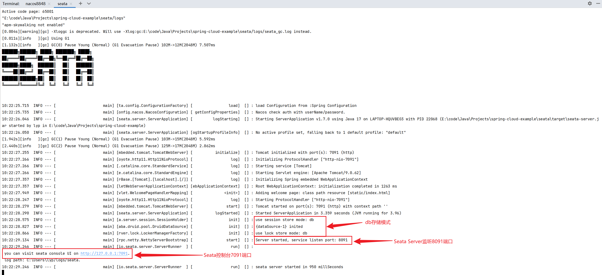

参考：

- https://seata.apache.org/zh-cn/docs/v1.7/overview/what-is-seata
- https://sca.aliyun.com/zh-cn/docs/2022.0.0.0/user-guide/seata/overview
- https://github.com/apache/incubator-seata

版本：

- Spring Cloud Alibaba 2022.0.0.0

- Seata Server 1.7.0

## Seata服务端部署

### 下载安装Seata服务器

下载地址：https://seata.apache.org/zh-cn/unversioned/release-history/seata-server

下载后解压即可。

### 使用Nacos作为配置中心

1.修改conf/application.yml

```yaml
seata:
  config:
    # support: nacos, consul, apollo, zk, etcd3
    type: nacos
    nacos:
      server-addr: 127.0.0.1:8848
      namespace:
      group: DEFAULT_GROUP
      username: nacos
      password: nacos
      context-path:
      ##if use MSE Nacos with auth, mutex with username/password attribute
      #access-key:
      #secret-key:
      data-id: seataServer.properties
```

2.在Nacos中新增配置：

- namespace：public
- group：DEFAULT_GROUP
- dataId：seataServer.properties

3.复制 script/config-center/config.txt 中的配置项到 seataServer.properties中

### 使用Nacos作为注册中心

修改conf/application.yml

```yaml
seata:
  registry:
    # support: nacos, eureka, redis, zk, consul, etcd3, sofa
    type: nacos
    nacos:
      application: seata-server
      server-addr: 127.0.0.1:8848
      group: DEFAULT_GROUP
      namespace:
      cluster: DEFAULT
      username: nacos
      password: nacos
      context-path:
      ##if use MSE Nacos with auth, mutex with username/password attribute
      #access-key:
      #secret-key:
```

### 使用MySQL作为配置存储库

1.新建数据库seata，执行script/server/db/mysql.sql脚本，创建Seata事务相关表，包括：

- global_table
- branch_table
- lock_table
- distributed_lock

2.修改Nacos中的seataServer.properties配置

```properties
#Transaction storage configuration, only for the server. The file, db, and redis configuration values are optional.
store.mode=db
store.lock.mode=db
store.session.mode=db
#Used for password encryption
store.publicKey=

#These configurations are required if the `store mode` is `db`. If `store.mode,store.lock.mode,store.session.mode` are not equal to `db`, you can remove the configuration block.
store.db.datasource=druid
store.db.dbType=mysql
store.db.driverClassName=com.mysql.cj.jdbc.Driver
store.db.url=jdbc:mysql://172.30.149.49:3306/seata?rewriteBatchedStatements=true&useUnicode=true&characterEncoding=utf-8&useSSL=false&allowPublicKeyRetrieval=true&serverTimezone=Asia/Shanghai
store.db.user=root
store.db.password=root
store.db.minConn=5
store.db.maxConn=30
store.db.globalTable=global_table
store.db.branchTable=branch_table
store.db.distributedLockTable=distributed_lock
store.db.queryLimit=100
store.db.lockTable=lock_table
store.db.maxWait=5000
```

### 配置事务分组映射

使用 `service.vgroupMapping.<事务分组名>=<Seata集群名>` 的格式，配置事务分组与Seata集群的映射规则。

Seata集群通过 conf/application.yml 中的 `seata.registry.nacos.cluster` 配置。

默认配置了 *default_tx_group* 事务分组，映射到 *default* 集群，这里修改为大写的 *DEFAULT*。

```properties
#Transaction routing rules configuration, only for the client
service.vgroupMapping.default_tx_group=DEFAULT
#If you use a registry, you can ignore it
#service.default.grouplist=127.0.0.1:8091
#service.enableDegrade=false
#service.disableGlobalTransaction=false
```

### 启动Seata服务器

`seata-server.bat`



### 验证

访问Seata控制台：http://127.0.0.1:7091

用户名/密码：seata/seata

## 客户端整合Seata

### 添加seata依赖

> 默认的seata-spring-boot-starter  1.7.0存在版本问题，用1.8.0替换

```xml
<dependency>
    <groupId>com.alibaba.cloud</groupId>
    <artifactId>spring-cloud-starter-alibaba-seata</artifactId>
    <exclusions>
        <exclusion>
            <groupId>io.seata</groupId>
            <artifactId>seata-spring-boot-starter</artifactId>
        </exclusion>
    </exclusions>
</dependency>
<dependency>
    <groupId>io.seata</groupId>
    <artifactId>seata-spring-boot-starter</artifactId>
    <version>1.8.0</version>
</dependency>
```

### 启用seata

```properties
seata.enabled=true
seata.application-id=${spring.application.name}
```

### Nacos配置中心相关配置

与Seata服务器中的配置一致

```properties
seata.config.type=nacos
seata.config.nacos.data-id=seataServer.properties
seata.config.nacos.server-addr=127.0.0.1:8848
seata.config.nacos.username=nacos
seata.config.nacos.password=nacos
seata.config.nacos.namespace=
seata.config.nacos.group=DEFAULT_GROUP
```

### Nacos注册中心相关配置

与Seata服务器中的配置一致

```properties
seata.registry.type=nacos
seata.registry.nacos.application=seata-server
seata.registry.nacos.server-addr=127.0.0.1:8848
seata.registry.nacos.username=nacos
seata.registry.nacos.password=nacos
seata.registry.nacos.namespace=
seata.registry.nacos.group=DEFAULT_GROUP
seata.registry.nacos.context-path=
```

### 配置事务分组名

客户端配置的事务分组名，需要与Seata服务端配置的事务分组映射一致。

```properties
seata.tx-service-group=default_tx_group
```

### 使用AT事务模式

> 数据源切换为druid，Seata与默认的hikari存在兼容问题

1.在客户端数据库中创建undo_log表

>  建表语句参阅：https://github.com/apache/incubator-seata/tree/2.x/script/client

```sql
-- for AT mode you must to init this sql for you business database. the seata server not need it.
CREATE TABLE IF NOT EXISTS `undo_log`
(
    `id`            BIGINT(20)   NOT NULL AUTO_INCREMENT COMMENT 'increment id',
    `branch_id`     BIGINT(20)   NOT NULL COMMENT 'branch transaction id',
    `xid`           VARCHAR(100) NOT NULL COMMENT 'global transaction id',
    `context`       VARCHAR(128) NOT NULL COMMENT 'undo_log context,such as serialization',
    `rollback_info` LONGBLOB     NOT NULL COMMENT 'rollback info',
    `log_status`    INT(11)      NOT NULL COMMENT '0:normal status,1:defense status',
    `log_created`   DATETIME     NOT NULL COMMENT 'create datetime',
    `log_modified`  DATETIME     NOT NULL COMMENT 'modify datetime',
    PRIMARY KEY (`id`),
    UNIQUE KEY `ux_undo_log` (`xid`, `branch_id`)
) ENGINE = InnoDB
  AUTO_INCREMENT = 1
  DEFAULT CHARSET = utf8 COMMENT ='AT transaction mode undo table';
```

2.添加以下配置

```properties
seata.enable-auto-data-source-proxy=true
seata.data-source-proxy-mode=AT
```

3.在业务方法上使用 `@GlobalTransactional` 注解

```java
@Service
public class OrderService {
    private final OrderRepository orderRepository;
    private final AccountServiceClient accountServiceClient;
    private final StorageServiceClient storageServiceClient;

    @Autowired
    public OrderService(OrderRepository orderRepository, 
            AccountServiceClient accountServiceClient, StorageServiceClient storageServiceClient) {
        this.orderRepository = orderRepository;
        this.accountServiceClient = accountServiceClient;
        this.storageServiceClient = storageServiceClient;
    }

    @GlobalTransactional
    public Order createOrder(OrderDTO dto) {
        Long userId = dto.getUserId();
        Long productId = dto.getProductId();
        Integer productCount = dto.getProductCount();

        // 1.扣减商品库存
        DeductDTO deductDTO = new DeductDTO();
        deductDTO.setProductId(productId);
        deductDTO.setProductCount(productCount);
        Boolean deductSuccess = storageServiceClient.deduct(deductDTO);

        // 查询商品信息(商品单价)
        ProductDTO product = storageServiceClient.getProductInfo(productId);
        BigDecimal productPrice = product.getProductPrice();
        BigDecimal money = productPrice.multiply(BigDecimal.valueOf(productCount));

        // 2.扣减账户余额
        DebitDTO debitDTO = new DebitDTO();
        debitDTO.setUserId(userId);
        debitDTO.setMoney(money);
        Boolean debitSuccess = accountServiceClient.debit(debitDTO);

        // 3.创建订单
        Order order = new Order();
        order.setUserId(userId);
        order.setProductId(productId);
        order.setProductCount(productCount);
        order.setAmount(money);
        order = orderRepository.save(order);
        return order;
    }
}
```

