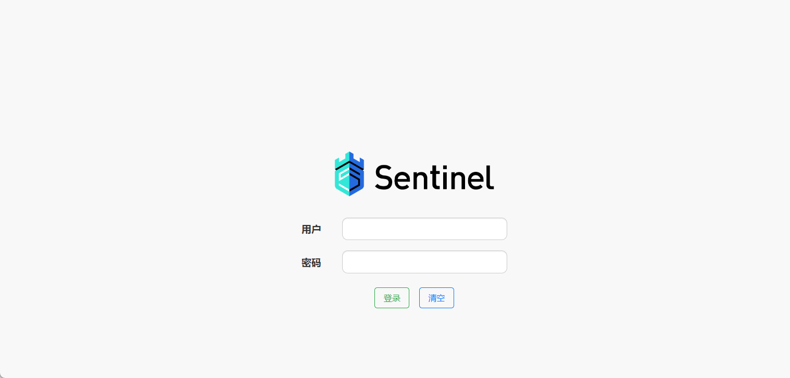
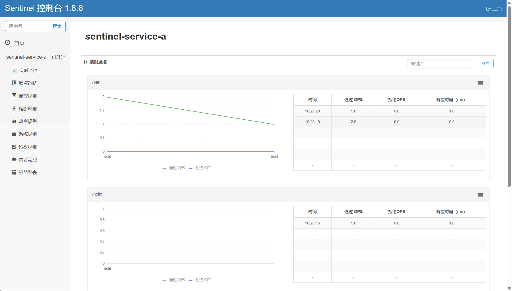

学习资料：

- https://sca.aliyun.com/zh-cn/docs/2022.0.0.0/user-guide/sentinel/overview
- https://sentinelguard.io/zh-cn/
- https://github.com/alibaba/Sentinel

版本信息：

- Sentinel 1.8.6

## Sentinel控制台

1.下载

https://github.com/alibaba/Sentinel/releases

2.启动控制台

`java -jar -Dserver.port=8880 sentinel-dashboard-1.8.6.jar `

或者

`java -jar sentinel-dashboard-1.8.6.jar --server.port=8880`

控制台配置参数：

- `server.port`，端口，默认8080
- `auth.enabled`，是否启用鉴权，默认true
- `sentinel.dashboard.auth.username`，用户名，默认sentinel
- `sentinel.dashboard.auth.password`，密码，默认sentinel

2.访问控制台

http://localhost:8880/ ，用户名/密码默认为 sentinel/sentinel



## 集成Sentinel客户端

### 添加依赖

```xml
<dependency>
    <groupId>com.alibaba.cloud</groupId>
    <artifactId>spring-cloud-starter-alibaba-sentinel</artifactId>
</dependency>
```

### 连接到控制台

- `spring.cloud.sentinel.transport.dashboard`，控制台地址
- `spring.cloud.sentinel.transport.port`，应用会在此端口启动1个HTTP Server，将控制台的配置推送到此Server，进而注册到Sentinel中。

```properties
spring.cloud.sentinel.enabled=true
spring.cloud.sentinel.transport.dashboard=127.0.0.1:8880
spring.cloud.sentinel.transport.port=8719
```

### 实时监控

随便调用几个接口，在sentinel控制台即可看到监控效果



## 资源(簇点链路)

Sentinel自动将每个URL当作一个资源。

自定义资源在方法上使用`@SentinelResource`注解，注解属性如下：

- `value`：资源名
- `blockHandler`：资源被流控时的处理方法名称
- `blockHandlerClass`：处理流控的方法所在的类
- `fallback`，资源抛出异常时的后备方法名称
- `fallbackClass`，后备方法所在的类
- `defaultFallback`，默认后备方法名称
- `exceptionsToTrace`，需要跟踪的异常列表
- `exceptionsToIgnore`：需要忽略的异常列表

示例：

```java
@RestController
public class HelloController {

    @GetMapping("/hello")
    @SentinelResource(value = "hello",
            blockHandler = "helloBlockHandler", blockHandlerClass = SentinelBlockHandlers.class,
            fallback = "helloFallback", fallbackClass = SentinelFallbacks.class)
    public String hello(@RequestParam(value = "name", required = false) String name) {
        if(name == null) {
            throw new IllegalArgumentException("name is null");
        }
        return "Hello, " + name;
    }

    /*public String helloBlockHandler(String name, BlockException ex) {
        if(ex instanceof FlowException e){
            return "处理流量控制";
        }else if(ex instanceof DegradeException e){
            return "处理熔断降级";
        }else if(ex instanceof ParamFlowException){
            return "处理热点参数限流";
        }else if(ex instanceof SystemBlockException e){
            return "处理系统自适应保护";
        }else if(ex instanceof AuthorityException e){
            return "处理授权(黑白名单保护)";
        }else{
            return ex.toString();
        }
    }*/

    /*public String helloFallback(String name, Throwable ex) {
        return ex.toString();
    }*/
}

public class SentinelBlockHandlers {
    /**
     * 流控方法必须是静态方法，接收BlockException作为最后一个参数
     * */
    public static String helloBlockHandler(String name, BlockException ex){
        if(ex instanceof FlowException e){
            return "处理流量控制";
        }else if(ex instanceof DegradeException e){
            return "处理熔断降级";
        }else if(ex instanceof ParamFlowException){
            return "处理热点参数限流";
        }else if(ex instanceof SystemBlockException e){
            return "处理系统自适应保护";
        }else if(ex instanceof AuthorityException e){
            return "处理授权(黑白名单保护)";
        }else{
            return ex.toString();
        }
    }
}

public class SentinelFallbacks {
    /**
     * 后备方法必须是static方法,接收Throwable作为最后一个参数
     * */
    public static String helloFallback(String name, Throwable ex) {
        return ex.toString();
    }
}
```

## 流控规则

统计类型：QPS、并发线程数

流控模式（资源调用关系）：直接、关联（统计调用方资源）、链路（统计调用入口资源）

流控效果：快速失败、Warm Up（预热时长）、排队等待（超时时间）

触发流控规则后，抛出`FlowException`异常。

## 熔断规则

熔断策略：慢调用比例、异常数、异常比例。

触发熔断规则抛出`DegradeException`异常。

## 热点参数限流规则


## 系统保护规则


## 授权保护规则(黑白名单)


## Sentinel规则持久化

1.将当前应用注册到nacos注册中心

2.添加依赖

```xml
<dependency>
    <groupId>com.alibaba.csp</groupId>
    <artifactId>sentinel-datasource-nacos</artifactId>
</dependency>
```

3.配置Sentinel数据源

- data-type，` Converter`类型，内置json和xml，默认json

- rule-type，规则类型，包括：flow, degrade, authority, system, param-flow, gw-flow, gw-api-group

```properties
# sentinel规则持久化
# flow: 流量控制
spring.cloud.sentinel.datasource.ds1.nacos.server-addr=${spring.cloud.nacos.server-addr}
spring.cloud.sentinel.datasource.ds1.nacos.username=nacos
spring.cloud.sentinel.datasource.ds1.nacos.password=nacos
spring.cloud.sentinel.datasource.ds1.nacos.namespace=public
spring.cloud.sentinel.datasource.ds1.nacos.group-id=DEFAULT_GROUP
spring.cloud.sentinel.datasource.ds1.nacos.data-id=${spring.application.name}-flow-rules
spring.cloud.sentinel.datasource.ds1.nacos.data-type=json
spring.cloud.sentinel.datasource.ds1.nacos.rule-type=flow
# degrade: 熔断降级
spring.cloud.sentinel.datasource.ds2.nacos.server-addr=${spring.cloud.nacos.server-addr}
spring.cloud.sentinel.datasource.ds2.nacos.username=nacos
spring.cloud.sentinel.datasource.ds2.nacos.password=nacos
spring.cloud.sentinel.datasource.ds2.nacos.namespace=public
spring.cloud.sentinel.datasource.ds2.nacos.group-id=DEFAULT_GROUP
spring.cloud.sentinel.datasource.ds2.nacos.data-id=${spring.application.name}-degrade-rules
spring.cloud.sentinel.datasource.ds2.nacos.data-type=json
spring.cloud.sentinel.datasource.ds2.nacos.rule-type=degrade
```

4.在nacos控制台中，新建配置文件，namespace, group, dataId要与Sentinel配置的一致。在其中定义流控规则，即可实现持久化的目的。

## OpenFeign启用Sentinel

```properties
feign.sentinel.enabled=true
```

