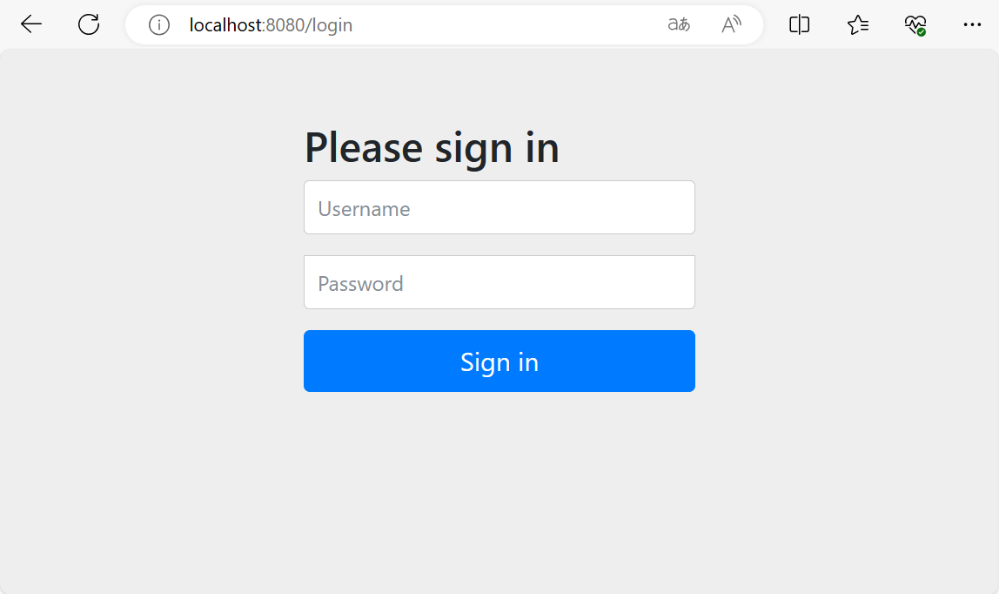

版本信息：

- JDK 17
- Maven 3.8.2
- Spring Boot 3.2.1
- Spring Security 6.2.1

## 准备工作

创建SpringBoot项目，并引入SpringSecurity。

添加依赖

```xml
<dependency>
    <groupId>org.springframework.boot</groupId>
    <artifactId>spring-boot-starter-web</artifactId>
</dependency>
<dependency>
    <groupId>org.springframework.boot</groupId>
    <artifactId>spring-boot-starter-security</artifactId>
</dependency>
<dependency>
    <groupId>org.springframework.boot</groupId>
    <artifactId>spring-boot-starter-thymeleaf</artifactId>
</dependency>
```

创建启动类

```java
@SpringBootApplication
public class WebSecurityApp {
    public static void main(String[] args) {
        SpringApplication.run(WebSecurityApp.class, args);
    }
}
```

创建配置文件application.properties

```properties
server.port=8080

spring.thymeleaf.enabled=true
spring.thymeleaf.encoding=UTF-8
spring.thymeleaf.prefix=classpath:/templates/
spring.thymeleaf.suffix=.html
```

创建一个测试Controller

```java
@Controller
public class HelloController {
}
```

在Controller中创建首页Controller方法，以及html模板文件

```java
@GetMapping("/")
public String index(){
    return "index";
}
```

templates/index.html

```html
<!DOCTYPE html>
<html lang="en" xmlns:th="https://www.thymeleaf.org">
<head>
    <meta charset="UTF-8">
    <title>Index</title>
</head>
<body>
<h1>Index</h1>
</body>
</html>
```

启动应用，此时访问 http://localhost:8080/，将自动跳转到SpringSecurity默认提供的登录页面 http://localhost:8080/login



输入用户名和密码（用户名user，密码在控制台输出中，是一个UUID字符串），即可访问index页面。

## 创建SpringSecurity配置类

创建配置类，并使用 `@EnableWebSecurity` 注解，然后注入一个 `SecurityFilterChain` 的Bean

```java
@Configuration
@EnableWebSecurity
public class WebSecurityConfiguration {

    @Bean
    public SecurityFilterChain securityFilterChain(HttpSecurity http) throws Exception {
        http.authorizeHttpRequests(authorizeHttpRequests -> authorizeHttpRequests.anyRequest()
                                                                                 .authenticated())
            .formLogin(Customizer.withDefaults());
        return http.build();
    }
}
```

为了避免在每次登录的时候，都从控制台中查找密码，这里在自定义一个用户，保存在内存中。这样就可以使用自定义的用户登录了

```java
@Bean
public UserDetailsService userDetailsService() {
    UserDetails admin = User.builder()
        .username("admin")
        .password("{noop}admin") // 使用明文密码
        .roles("USER", "ADMIN")
        .build();
    return new InMemoryUserDetailsManager(admin);
}
```

## 自定义登录表单页面

修改SpringSecurity配置类

```java
// http.formLogin(Customizer.withDefaults())
http.formLogin(form -> form.usernameParameter("username") // 自定义用户名参数名称
               .passwordParameter("password") // 自定义密码参数名称
               .loginPage("/login") // 指定登录表单页面URL
               .loginProcessingUrl("/login") // 指定处理登录请求的URL
               .defaultSuccessUrl("/") // 默认登录成功跳转页面URL
               .failureUrl("/login") // 默认登录失败页面URL
               .permitAll());
```

创建登录控制器LoginController，定义登录表单页面控制器方法

```java
@Controller
public class LoginController {

    @GetMapping("/login")
    public String login(){
        return "login";
    }
}
```

创建登录表单页面html文件

```html
<!DOCTYPE html>
<html lang="en" xmlns:th="https://www.thymeleaf.org">
<head>
    <meta charset="UTF-8">
    <title>Login</title>
</head>
<body>
<h1>Please Log In</h1>
<div th:if="${param.error}">
    Invalid username and password.
</div>
<div th:if="${param.logout}">
    You have been logged out.
</div>
<form th:action="@{/login}" method="post">
    <!--<input type="hidden" th:name="${_csrf.parameterName}" th:value="${_csrf.token}">-->

    <div>
        <input type="text" name="username" placeholder="Username"/>
    </div>
    <div>
        <input type="password" name="password" placeholder="Password"/>
    </div>
    <input type="submit" value="Log in"/>
</form>
</body>
</html>
```

重启应用，访问 http://localhost:8080/ 页面，自动跳转到登录表单页面


输入用户名/密码，成功跳转到首页。

## 自定义退出登录

在SpringSecurity配置类中添加以下配置

```java
http.logout(logout -> logout.logoutUrl("/logout") // 指定处理退出请求的URL
            .logoutSuccessUrl("/login") // 指定退出成功跳转页面URL
            .invalidateHttpSession(true) // 清除Session信息
            .clearAuthentication(true)); // 清除认证信息
```

在index页面的html模板中添加退出按钮（必须使用POST请求方式）

```html
<form th:action="@{/logout}" method="post">
    <button type="submit">Logout</button>
</form>
```

## 会话管理


## 实现Remember-Me认证

Remember-me认证是通过向浏览器发送一个cookie来实现的，在之后的会话中，服务器会检测到cookie，由此实现自动登录功能。
