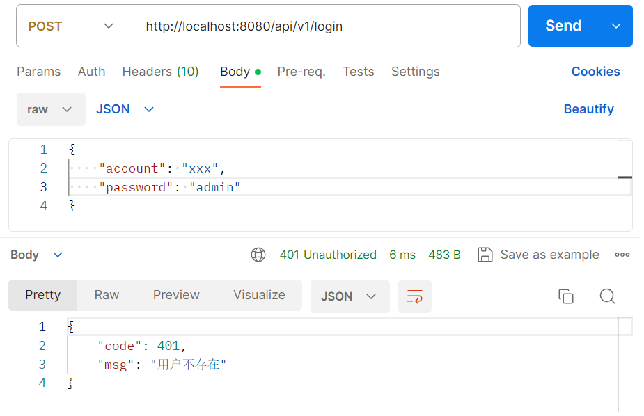
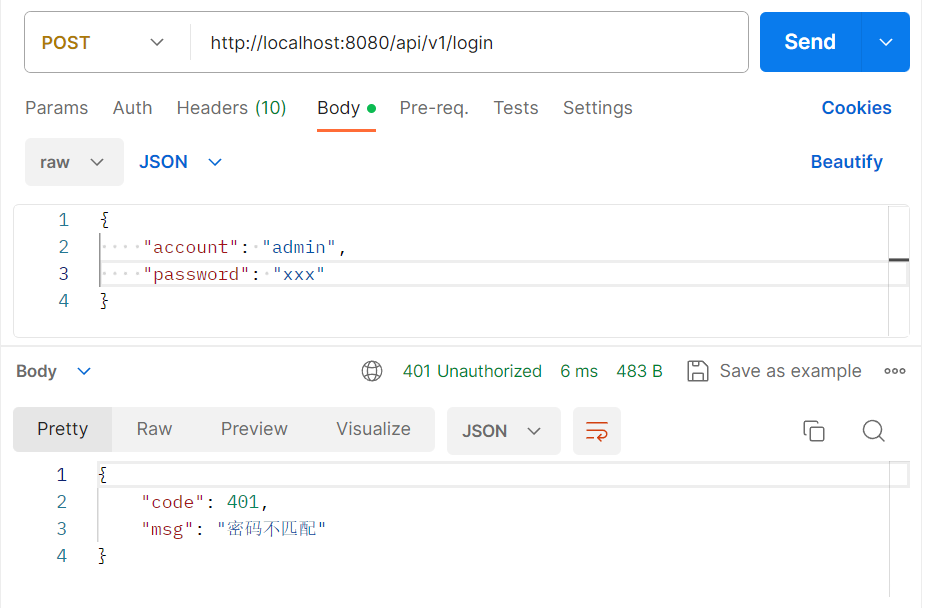
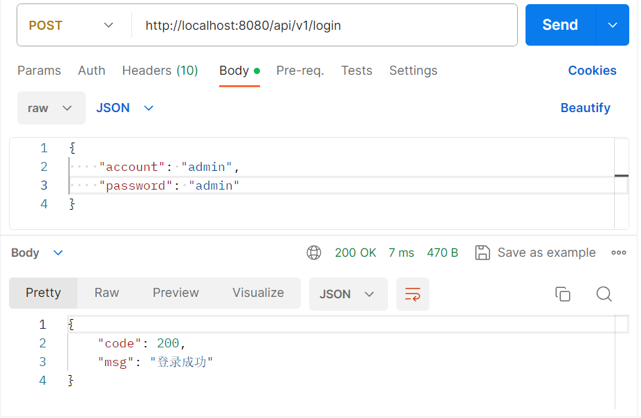
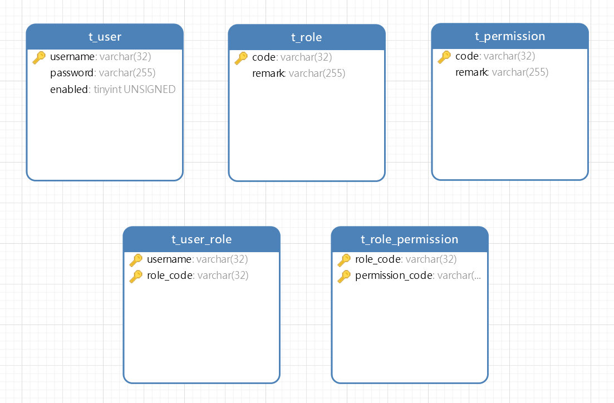
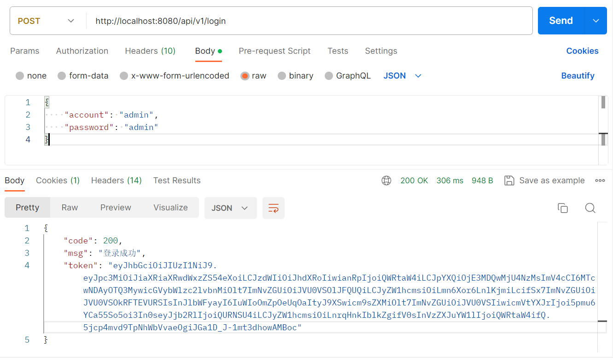
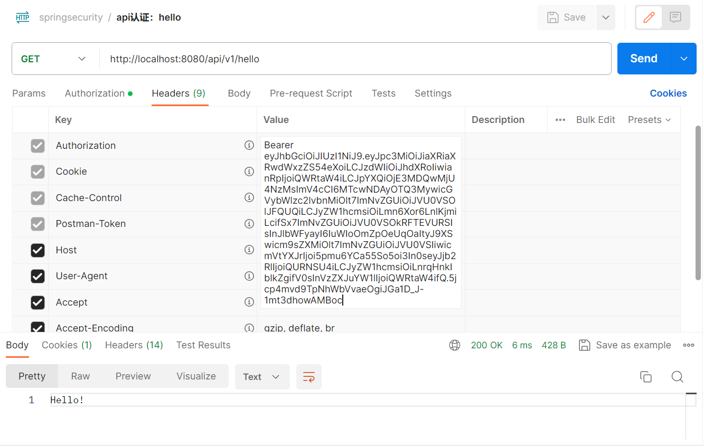
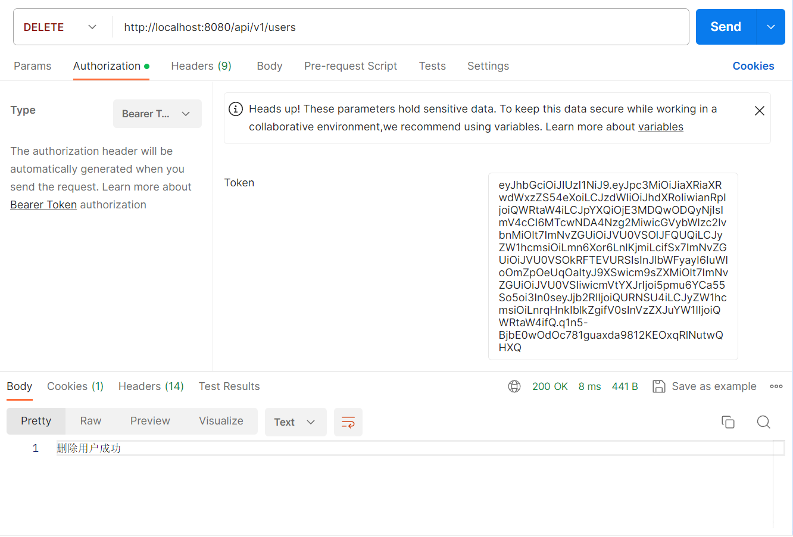

版本信息：

- JDK 17
- Maven 3.8.2
- Spring Boot 3.2.1
- Spring Security 6.2.1
- MyBatis 3.0.3

## 准备工作

创建SpringBoot项目，并引入SpringSecurity。

添加依赖

```xml
<dependency>
    <groupId>org.springframework.boot</groupId>
    <artifactId>spring-boot-starter-web</artifactId>
</dependency>
<dependency>
    <groupId>org.springframework.boot</groupId>
    <artifactId>spring-boot-starter-security</artifactId>
</dependency>
```

创建启动类

```java
@SpringBootApplication
public class ApiSecurityApp {
    public static void main(String[] args) {
        SpringApplication.run(ApiSecurityApp.class, args);
    }
}
```

创建配置文件application.properties

```properties
server.port=8080
```

## 创建SpringSecurity配置类

创建配置类，并使用 `@EnableWebSecurity` 注解，然后注入一个 `SecurityFilterChain` 的Bean

```java
@Configuration
@EnableWebSecurity
public class ApiSecurityConfiguration {

    @Bean
    public SecurityFilterChain filterChain(HttpSecurity http) throws Exception{
        return http.build();
    }
}
```

为了方便测试，自定义一个用户，保存在内存中

```java
@Bean
public UserDetailsService userDetailsService() {
    UserDetails admin = User.builder()
        .username("admin")
        .password("admin")
        .roles("USER", "ADMIN")
        .build();

    return new InMemoryUserDetailsManager(admin);
}
```

## 自定义登录认证逻辑

### 定义 `Authentication`

用于存储用户信息。

继承 `AbstractAuthenticationToken` 抽象类。

> 参考 `UsernamePasswordAuthenticationToken`

```java
public class AccountPasswordAuthenticationToken extends AbstractAuthenticationToken {
    @Serial private static final long serialVersionUID = 20230101000000L;

    private final Object principal;

    private Object credentials;

    public AccountPasswordAuthenticationToken(Object principal, Object credentials) {
        super(null);
        this.principal = principal;
        this.credentials = credentials;
        super.setAuthenticated(false);
    }

    public AccountPasswordAuthenticationToken(Object principal, Object credentials, Collection<? extends GrantedAuthority> authorities) {
        super(authorities);
        this.principal = principal;
        this.credentials = credentials;
        super.setAuthenticated(true);
    }

    @Override
    public Object getPrincipal() {
        return principal;
    }

    @Override
    public Object getCredentials() {
        return credentials;
    }
}
```

### 定义登录认证 `Filter`

拦截登录请求，从请求中获取认证信息，封装为 `Authentication` 对象，最终由 `AuthenticationManager` 调用相应的 `AuthenticationProvider` 进行具体的认证逻辑。

继承 `AbstractAuthenticationProcessingFilter` 抽象类。

> 参考 `UsernamePasswordAuthenticationFilter`

```java
public class AccountPasswordAuthenticationFilter extends AbstractAuthenticationProcessingFilter {
    public static final String SPRING_SECURITY_USERNAME_KEY = "account";

    public static final String SPRING_SECURITY_PASSWORD_KEY = "password";

    private static final AntPathRequestMatcher DEFAULT_ANT_PATH_REQUEST_MATCHER = new AntPathRequestMatcher("/api/v1/login", "POST");

    private String usernameParameter = SPRING_SECURITY_USERNAME_KEY;

    private String passwordParameter = SPRING_SECURITY_PASSWORD_KEY;

    private boolean postOnly = true;

    private static final ObjectMapper objectMapper = new ObjectMapper();

    public AccountPasswordAuthenticationFilter(){
        super(DEFAULT_ANT_PATH_REQUEST_MATCHER);
    }

    public AccountPasswordAuthenticationFilter(AuthenticationManager authenticationManager){
        super(DEFAULT_ANT_PATH_REQUEST_MATCHER, authenticationManager);
    }

    @Override
    public Authentication attemptAuthentication(HttpServletRequest request, HttpServletResponse response) throws AuthenticationException, IOException, ServletException {
        // 只允许POST请求
        if (this.postOnly && !request.getMethod().equals("POST")) {
            throw new AuthenticationServiceException("Authentication method not supported: " + request.getMethod());
        }
        // 只接收JSON数据
        if(!MediaType.APPLICATION_JSON_VALUE.equals(request.getContentType())){
            throw new AuthenticationServiceException("Authentication content-type not supported: " + request.getContentType());
        }
        // 从请求中获取登录认证数据
        Map<String, String> requestBody = obtainRequestBody(request);
        String username = requestBody.getOrDefault(usernameParameter, "");
        String password = requestBody.getOrDefault(passwordParameter, "");

        AccountPasswordAuthenticationToken authentication = new AccountPasswordAuthenticationToken(username, password);
        return this.getAuthenticationManager().authenticate(authentication);
    }

    private Map<String,String> obtainRequestBody(HttpServletRequest request) throws IOException {
        ServletInputStream in = request.getInputStream();
        return objectMapper.readValue(in, new TypeReference<Map<String,String>>() {});
    }

    public void setUsernameParameter(String usernameParameter) {
        this.usernameParameter = usernameParameter;
    }

    public void setPasswordParameter(String passwordParameter) {
        this.passwordParameter = passwordParameter;
    }

    public void setPostOnly(boolean postOnly) {
        this.postOnly = postOnly;
    }
}
```

### 定义 `AuthenticationProvider`

负责具体的认证逻辑，使用 `UserDetailsService` 和 `PasswordEncoder` 来验证用户名和密码。

实现 `AuthenticationProvider` 接口。

> 参考 `AbstractUserDetailsAuthenticationProvider` 及其子类 `DaoAuthenticationProvider`

```java
public class AccountPasswordAuthenticationProvider implements AuthenticationProvider {

    private PasswordEncoder passwordEncoder;
    
    private UserDetailsService userDetailsService;

    @Override
    public Authentication authenticate(Authentication authentication) throws AuthenticationException {
        String username = authentication.getName();
        // 查询用户
        UserDetails userDetails = retrieveUser(username);
        // 其它认证检查(用户是否禁用, 是否过期, 密码是否正确等)
        additionalAuthenticationChecks(userDetails, (AccountPasswordAuthenticationToken)authentication);

        // 认证通过, 返回Authentication对象
        return new AccountPasswordAuthenticationToken(userDetails, authentication.getCredentials(), userDetails.getAuthorities());
    }

    @Override
    public boolean supports(Class<?> authentication) {
        return AccountPasswordAuthenticationToken.class.isAssignableFrom(authentication);
    }

    private UserDetails retrieveUser(String username){
        return userDetailsService.loadUserByUsername(username);
    }

    private void additionalAuthenticationChecks(UserDetails userDetails,
            AccountPasswordAuthenticationToken authentication) throws AuthenticationException {
        Object credentials = authentication.getCredentials();
        String rawPassword = (credentials == null) ? "" : credentials.toString();
        if(!passwordEncoder.matches(rawPassword, userDetails.getPassword())){
            throw new BadCredentialsException("密码错误");
        }
        
        if(!userDetails.isEnabled()){
            throw new DisabledException("账号已被禁用");
        }
        if(!userDetails.isAccountNonLocked()){
            throw new LockedException("账号已被锁定");
        }
        if(!userDetails.isAccountNonExpired()){
            throw new AccountExpiredException("账号已过期");
        }
        if(!userDetails.isCredentialsNonExpired()){
            throw new CredentialsExpiredException("密码已过期");
        }
    }

    public void setPasswordEncoder(PasswordEncoder passwordEncoder) {
        this.passwordEncoder = passwordEncoder;
    }

    public void setUserDetailsService(UserDetailsService userDetailsService) {
        this.userDetailsService = userDetailsService;
    }
}
```

### 定义认证成功/失败处理器

认证成功处理器，实现 `AuthenticationSuccessHandler` 接口

```java
public class CustomAuthenticationSuccessHandler implements AuthenticationSuccessHandler {
    private final ObjectMapper objectMapper;

    public CustomAuthenticationSuccessHandler(ObjectMapper objectMapper){
        this.objectMapper = objectMapper;
    }

    @Override
    public void onAuthenticationSuccess(HttpServletRequest request, HttpServletResponse response, Authentication authentication) throws IOException, ServletException {
        response.setStatus(HttpStatus.OK.value());
        response.setContentType(MediaType.APPLICATION_JSON_VALUE);
        response.setCharacterEncoding(StandardCharsets.UTF_8.displayName());

        ApiResponse<String> apiResponse = ApiResponse.success("认证通过");
        String data = objectMapper.writeValueAsString(apiResponse);
        try (PrintWriter writer = response.getWriter()){
            writer.write(data);
        }
    }
}
```

认证失败处理器，实现 `AuthenticationFailureHandler` 接口

```java
public class CustomAuthenticationFailureHandler implements AuthenticationFailureHandler {
    private final ObjectMapper objectMapper;

    public CustomAuthenticationFailureHandler(ObjectMapper objectMapper) {
        this.objectMapper = objectMapper;
    }

    @Override
    public void onAuthenticationFailure(HttpServletRequest request, HttpServletResponse response, AuthenticationException exception) throws IOException, ServletException {
        response.setStatus(HttpStatus.UNAUTHORIZED.value());
        response.setContentType(MediaType.APPLICATION_JSON_VALUE);
        response.setCharacterEncoding(StandardCharsets.UTF_8.displayName());

        String message = exception.getMessage();
        ApiResponse<String> apiResponse = ApiResponse.fail(ApiStatus.UNAUTHORIZED.getCode(), message);
        String data = objectMapper.writeValueAsString(apiResponse);
        try (PrintWriter writer = response.getWriter()){
            writer.write(data);
        }
    }
}
```

### 配置认证信息

```java
@Configuration
@EnableWebSecurity
public class ApiSecurityConfiguration {

    @Bean
    public SecurityFilterChain filterChain(HttpSecurity http) throws Exception {
        http.authorizeHttpRequests(authorizeHttpRequests -> authorizeHttpRequests.requestMatchers("/api/v1/login")
                                                                                 .permitAll()
                                                                                 .anyRequest()
                                                                                 .authenticated());

        // 配置Filter
        http.addFilterAt(accountPasswordAuthenticationFilter(), UsernamePasswordAuthenticationFilter.class);

        // 配置AuthenticationProvider
        http.authenticationProvider(accountPasswordAuthenticationProvider());

        // 禁用Session
        http.sessionManagement(session -> session.sessionCreationPolicy(SessionCreationPolicy.STATELESS));
        // 禁用csrf保护
        http.csrf(csrf -> csrf.disable());

        return http.build();
    }

    @Bean
    public UserDetailsService userDetailsService() {
        UserDetails admin = User.builder()
                                .username("admin")
                                .password("admin")
                                .roles("USER", "ADMIN")
                                .build();

        return new InMemoryUserDetailsManager(admin);
    }

    /**
     * PasswordEncoder
     */
    @Bean
    public PasswordEncoder passwordEncoder() {
        return NoOpPasswordEncoder.getInstance();
    }

    /**
     * 注入AuthenticationConfiguration, 用于获取AuthenticationManager
     */
    @Resource
    private AuthenticationConfiguration authenticationConfiguration;

    /**
     * AuthenticationManager
     */
    @Bean
    public AuthenticationManager authenticationManager() throws Exception {
        return this.authenticationConfiguration.getAuthenticationManager();
    }

    /**
     * Filter: 账号密码认证过滤器
     */
    @Bean
    public Filter accountPasswordAuthenticationFilter() throws Exception {
        AccountPasswordAuthenticationFilter filter = new AccountPasswordAuthenticationFilter();
        filter.setAuthenticationManager(authenticationManager());
        filter.setAuthenticationSuccessHandler(authenticationSuccessHandler());
        filter.setAuthenticationFailureHandler(authenticationFailureHandler());
        return filter;
    }

    /**
     * AuthenticationProvider: 账号密码认证Provider
     */
    @Bean
    public AuthenticationProvider accountPasswordAuthenticationProvider() {
        AccountPasswordAuthenticationProvider provider = new AccountPasswordAuthenticationProvider();
        provider.setPasswordEncoder(passwordEncoder());
        provider.setUserDetailsService(userDetailsService());
        return provider;
    }

    /**
     * 认证成功处理器
     */
    @Bean
    public CustomAuthenticationSuccessHandler authenticationSuccessHandler() {
        return new CustomAuthenticationSuccessHandler();
    }

    /**
     * 认证失败处理器
     */
    @Bean
    public CustomAuthenticationFailureHandler authenticationFailureHandler() {
        return new CustomAuthenticationFailureHandler();
    }
}
```

### 测试

输入错误的用户名



输入错误的密码



输入正确的用户名和密码




## 密码加密

注入一个 `PasswordEncoder` 接口实现类的Bean

```java
@Bean
public PasswordEncoder passwordEncoder() {
    // return NoOpPasswordEncoder.getInstance();
    return new BCryptPasswordEncoder();
}
```

使用 `encode(rowPassword)` 方法加密，使用 `matches(rawPassword, encodedPassword)` 方法匹配密码。

## 自定义认证数据源

### 准备工作

**建表: RBAC权限模型**

经典的RBAC权限模型，需要5张表：用户表、角色表、权限表、用户-角色关系表、角色-权限关系表。



**集成MyBatis**

添加依赖

```xml
<dependency>
    <groupId>org.mybatis.spring.boot</groupId>
    <artifactId>mybatis-spring-boot-starter</artifactId>
</dependency>
<dependency>
    <groupId>mysql</groupId>
    <artifactId>mysql-connector-java</artifactId>
</dependency>
```

配置数据源和mybatis

```properties
spring.datasource.driver-class-name=com.mysql.cj.jdbc.Driver
spring.datasource.url=jdbc:mysql://localhost:3306/study?useUnicode=true&characterEncoding=utf-8&useSSL=false&serverTimezone=Asia/Shanghai
spring.datasource.username=root
spring.datasource.password=root

mybatis.type-aliases-package=me.lyp.api.entity
mybatis.mapper-locations=classpath:/mapper/*.xml
mybatis.configuration.map-underscore-to-camel-case=true
mybatis.configuration.log-impl=org.apache.ibatis.logging.slf4j.Slf4jImpl
```

**编写代码**

创建与数据表对应的实体类

(略)

创建用户Mapper接口以及相应的xml映射文件，添加根据用户名查询用户及其角色和权限的方法

*UserMapper.java*

```java
@Mapper
public interface UserMapper {
    User selectOneByUsername(@Param("username") String username);
}
```

*UserMapper.xml*

```xml
<?xml version="1.0" encoding="UTF-8" ?>
<!DOCTYPE mapper
        PUBLIC "-//mybatis.org//DTD Mapper 3.0//EN"
        "https://mybatis.org/dtd/mybatis-3-mapper.dtd">
<mapper namespace="me.lyp.api.mapper.UserMapper">
    <resultMap id="userResultMap" type="User" autoMapping="true">
        <id column="username" property="username"/>

        <collection property="roles" ofType="Role" columnPrefix="r_" autoMapping="true">
            <id column="code" property="code"/>
        </collection>
        <collection property="permissions" ofType="Permission" columnPrefix="p_" autoMapping="true">
            <id column="code" property="code"/>
        </collection>
    </resultMap>

    <select id="selectOneByUsername" parameterType="string" resultMap="userResultMap">
        WITH cte_user AS(
        SELECT *
        FROM `t_user`
        WHERE username = #{username}
        LIMIT 1
        )

        SELECT cte_user.*,
        t2.code     AS r_code,
        t2.remark   AS r_remark,
        t4.code     AS p_code,
        t4.remark   AS p_remark
        FROM cte_user LEFT JOIN t_user_role AS t1 ON cte_user.username = t1.username
        LEFT JOIN t_role AS t2 ON t1.role_code = t2.code
        LEFT JOIN t_role_permission AS t3 ON t2.code = t3.role_code
        LEFT JOIN t_permission AS t4 ON t3.permission_code = t4.code
    </select>
</mapper>
```

### 定义 `UserDetails`

`UserDetails` 用于存储用户信息，这些信息将被封装为 `Authentication` 对象。

```java
public class CustomUserDetails implements UserDetails {

    private final User user;

    public CustomUserDetails(User user) {
        this.user = user;
    }

    /**
     * 返回用户权限集合，包括role和scope，role需要以ROLE_开头
     */
    @Override
    public Collection<? extends GrantedAuthority> getAuthorities() {
        Collection<SimpleGrantedAuthority> authorities = new HashSet<>();

        Set<Role> roles = user.getRoles();
        Set<Permission> permissions = user.getPermissions();

        if(!CollectionUtils.isEmpty(roles)) {
            Set<SimpleGrantedAuthority> roleSet = roles.stream()
                                                       .map(role -> new SimpleGrantedAuthority("ROLE_" + role.getCode()))
                                                       .collect(Collectors.toSet());
            authorities.addAll(roleSet);
        }

        if(!CollectionUtils.isEmpty(permissions)) {
            Set<SimpleGrantedAuthority> permissionSet = permissions.stream()
                                                                   .map(permission -> new SimpleGrantedAuthority(permission.getCode()))
                                                                   .collect(Collectors.toSet());
            authorities.addAll(permissionSet);
        }
        return authorities;
    }

    @Override
    public String getPassword() {
        return user.getPassword();
    }

    @Override
    public String getUsername() {
        return user.getUsername();
    }

    @Override
    public boolean isAccountNonExpired() {
        return true;
    }

    @Override
    public boolean isAccountNonLocked() {
        return true;
    }

    @Override
    public boolean isCredentialsNonExpired() {
        return true;
    }

    @Override
    public boolean isEnabled() {
        return user.getEnabled();
    }

    public User getUser() {
        return user;
    }
}
```

### 定义 `UserDetailsService`

`UserDetailsService` 是加载特定用户的核心接口，在SpringSecurity框架中作为用户数据访问对象(DAO)

```java
public class CustomUserDetailsService implements UserDetailsService {

    private final UserMapper userMapper;

    public CustomUserDetailsService(UserMapper userMapper){
        this.userMapper = userMapper;
    }

    @Override
    public UserDetails loadUserByUsername(String username) throws UsernameNotFoundException {
        User user = userMapper.selectOneByUsername(username);
        if(user == null){
            throw new UsernameNotFoundException("用户不存在");
        }
        return new CustomUserDetails(user);
    }
}
```

### 配置

向Spring容器中注入自定义的 `UserDetailsService` Bean即可

```java
/*
@Bean
public UserDetailsService userDetailsService() {
    UserDetails admin = User.builder()
                            .username("admin")
                            .password("$2a$10$vszQ9UpM4zeouQNoLWWAyOlsIuWxxcHY9zSwseN95ZihkLCgGbh4.")
                            .roles("USER", "ADMIN")
                            .build();

    return new InMemoryUserDetailsManager(admin);
}
*/

@Resource
private UserMapper userMapper;

@Bean
public CustomUserDetailsService userDetailsService(){
    return new CustomUserDetailsService(userMapper);
}
```

## 通过多条Filter链支持多用户表认证

> 以面向门户网站的普通用户认证和面向后台管理系统的管理员用户认证为例。

### 准备工作

**建表**

创建管理员用户表（略）

**创建管理员用户表对应的实体类**

```java
@Data
public class AdminUser {
    private String username;
    private String password;
}
```

**创建Mapper接口以及xml映射文件**

> 这里作为测试，并没有真的创建表，而是直接在sql中返回模拟用户数据

```java
@Mapper
public interface AdminUserMapper {

    @Select("""
            SELECT 'admin' AS username,
                   '$2a$10$OsizY1GBMmBPtwNiH0GyLezMgMaqV9ESoGOhKzAnnmVtRD.5orMyu' AS `password`
            FROM DUAL
            """)
    AdminUser selectOneByUsername(String username);
}
```

### 定义 `UserDetails` 和 `UserDetailsService` 的实现类

*CustomAdminUserDetails*

```java
public class CustomAdminUserDetails implements UserDetails {

    private final AdminUser user;

    public CustomAdminUserDetails(AdminUser user){
        this.user = user;
    }

    @Override
    public Collection<? extends GrantedAuthority> getAuthorities() {
        Collection<GrantedAuthority> authorities = new HashSet<>();
        return authorities;
    }

    @Override
    public String getPassword() {
        return user.getPassword();
    }

    @Override
    public String getUsername() {
        return user.getUsername();
    }

    @Override
    public boolean isAccountNonExpired() {
        return true;
    }

    @Override
    public boolean isAccountNonLocked() {
        return true;
    }

    @Override
    public boolean isCredentialsNonExpired() {
        return true;
    }

    @Override
    public boolean isEnabled() {
        return true;
    }
}
```

*CustomAdminUserDetailsService*

```java
public class CustomAdminUserDetailsService implements UserDetailsService {
    private final AdminUserMapper adminUserMapper;

    public CustomAdminUserDetailsService(AdminUserMapper adminUserMapper) {
        this.adminUserMapper = adminUserMapper;
    }

    @Override
    public UserDetails loadUserByUsername(String username) throws UsernameNotFoundException {
        AdminUser user = adminUserMapper.selectOneByUsername(username);
        if(user == null){
            throw new UsernameNotFoundException("用户不存在");
        }
        return new CustomAdminUserDetails(user);
    }
}
```

### 定义 `Authentication`，`Filter`，`AuthenticationProvider` 的实现类

**`Authentication`** 直接使用SpringSecurity自带的 `UsernamePasswordAuthenticationToken`。

*AdminUsernamePasswordAuthenticationFilter*

```java
public class AdminUsernamePasswordAuthenticationFilter extends AbstractAuthenticationProcessingFilter {
    public static final String SPRING_SECURITY_USERNAME_KEY = "username";

    public static final String SPRING_SECURITY_PASSWORD_KEY = "password";

    private static final AntPathRequestMatcher DEFAULT_ANT_PATH_REQUEST_MATCHER = new AntPathRequestMatcher("/admin/login", "POST");

    private String usernameParameter = SPRING_SECURITY_USERNAME_KEY;

    private String passwordParameter = SPRING_SECURITY_PASSWORD_KEY;

    private boolean postOnly = true;

    private static final ObjectMapper objectMapper = new ObjectMapper();

    public AdminUsernamePasswordAuthenticationFilter(){
        super(DEFAULT_ANT_PATH_REQUEST_MATCHER);
    }

    public AdminUsernamePasswordAuthenticationFilter(AuthenticationManager authenticationManager){
        super(DEFAULT_ANT_PATH_REQUEST_MATCHER, authenticationManager);
    }

    @Override
    public Authentication attemptAuthentication(HttpServletRequest request, HttpServletResponse response) throws AuthenticationException, IOException, ServletException {
        // 只允许POST请求
        if (this.postOnly && !request.getMethod().equals("POST")) {
            throw new AuthenticationServiceException("Authentication method not supported: " + request.getMethod());
        }
        // 只接收JSON数据
        if(!MediaType.APPLICATION_JSON_VALUE.equals(request.getContentType())){
            throw new AuthenticationServiceException("Authentication content-type not supported: " + request.getContentType());
        }
        // 从请求中获取登录认证数据
        Map<String, String> requestBody = obtainRequestBody(request);
        String username = requestBody.get(this.usernameParameter);
        username = (username != null) ? username.trim() : "";
        String password = requestBody.get(this.passwordParameter);
        password = (password != null) ? password.trim() : "";

        UsernamePasswordAuthenticationToken authentication = new UsernamePasswordAuthenticationToken(username, password);
        return this.getAuthenticationManager().authenticate(authentication);
    }

    private Map<String,String> obtainRequestBody(HttpServletRequest request) throws IOException {
        ServletInputStream in = request.getInputStream();
        return objectMapper.readValue(in, new TypeReference<Map<String,String>>() {});
    }

    public void setUsernameParameter(String usernameParameter) {
        this.usernameParameter = usernameParameter;
    }

    public void setPasswordParameter(String passwordParameter) {
        this.passwordParameter = passwordParameter;
    }

    public void setPostOnly(boolean postOnly) {
        this.postOnly = postOnly;
    }
}
```

*AdminUsernamePasswordAuthenticationProvider*

```java
public class AdminUsernamePasswordAuthenticationProvider implements AuthenticationProvider {

    private PasswordEncoder passwordEncoder;

    private UserDetailsService userDetailsService;

    @Override
    public Authentication authenticate(Authentication authentication) throws AuthenticationException {
        String username = authentication.getName();
        // 查询用户
        UserDetails userDetails = retrieveUser(username);
        // 其它认证检查(用户是否禁用, 是否过期, 密码是否正确等)
        additionalAuthenticationChecks(userDetails, (UsernamePasswordAuthenticationToken)authentication);

        // 认证通过, 返回Authentication对象
        return new UsernamePasswordAuthenticationToken(userDetails, authentication.getCredentials(), userDetails.getAuthorities());
    }

    @Override
    public boolean supports(Class<?> authentication) {
        return UsernamePasswordAuthenticationToken.class.isAssignableFrom(authentication);
    }

    private UserDetails retrieveUser(String username){
        try {
            return userDetailsService.loadUserByUsername(username);
        }catch(UsernameNotFoundException ex){
            throw new UsernameNotFoundException("用户不存在");
        }
        catch (Exception ex) {
            throw new InternalAuthenticationServiceException(ex.getMessage(), ex);
        }
    }

    private void additionalAuthenticationChecks(UserDetails userDetails,
            UsernamePasswordAuthenticationToken authentication) throws AuthenticationException {
        if(authentication.getCredentials() == null){
            throw new BadCredentialsException("密码为空");
        }

        String presentedPassword = authentication.getCredentials().toString();
        if(!passwordEncoder.matches(presentedPassword, userDetails.getPassword())){
            throw new BadCredentialsException("密码不匹配");
        }

        if(!userDetails.isEnabled()){
            throw new DisabledException("账号已被禁用");
        }
        if(!userDetails.isAccountNonLocked()){
            throw new LockedException("账号已被锁定");
        }
        if(!userDetails.isAccountNonExpired()){
            throw new AccountExpiredException("账号已过期");
        }
        if(!userDetails.isCredentialsNonExpired()){
            throw new CredentialsExpiredException("密码已过期");
        }
    }

    public void setPasswordEncoder(PasswordEncoder passwordEncoder) {
        this.passwordEncoder = passwordEncoder;
    }

    public void setUserDetailsService(UserDetailsService userDetailsService) {
        this.userDetailsService = userDetailsService;
    }
}
```

### 配置多个  `AuthenticationManager` Bean和多条Filter链

**配置多个的 `AuthenticationManager`**

不同的Filter链，需要使用不同的 `AuthenticationManager` ，来管理一个或多个 `AuthenticationProvider`。使用其实现类 `ProviderManager` 即可。

> 注意：有多个  `AuthenticationManager` Bean时，需要使用原生注解 `@Primary` 指定默认的Bean

这里配置2个 `AuthenticationManager` Bean：

普通用户认证

```java
@Bean
@Primary
public AuthenticationManager authenticationManager(){
    return new ProviderManager(accountPasswordAuthenticationProvider());
}

/**
 * AuthenticationProvider: 普通用户账号密码认证Provider
 */
@Bean
public AuthenticationProvider accountPasswordAuthenticationProvider() {
    AccountPasswordAuthenticationProvider provider = new AccountPasswordAuthenticationProvider();
    provider.setPasswordEncoder(passwordEncoder());
    provider.setUserDetailsService(userDetailsService());
    return provider;
}

@Resource private UserMapper userMapper;

@Bean
public CustomUserDetailsService userDetailsService() {
    return new CustomUserDetailsService(userMapper);
}
```

管理员用户认证

```java
/**
 * 创建AuthenticationManager
 */
@Bean
public AuthenticationManager adminAuthenticationManager() {
    return new ProviderManager(adminUsernamePasswordAuthenticationProvider());
}

/**
 * AuthenticationProvider: 管理员用户名密码认证Provider
 */
@Bean
public AuthenticationProvider adminUsernamePasswordAuthenticationProvider() {
    AdminUsernamePasswordAuthenticationProvider provider = new AdminUsernamePasswordAuthenticationProvider();
    provider.setPasswordEncoder(passwordEncoder());
    provider.setUserDetailsService(adminUserDetailsService());
    return provider;
}

@Resource private AdminUserMapper adminUserMapper;

@Bean
public UserDetailsService adminUserDetailsService() {
    return new CustomAdminUserDetailsService(adminUserMapper);
}
```

**配置多条Filter链**

多条Filter链，每条链执行不同的认证逻辑。使用 `HttpSecurity#securityMatchers` 方法可以限制当前Filter链能处理的HTTP请求URL。

这里配置2条Filter链：

普通用户认证Filter链

```java
@Bean
@Order(0)
public SecurityFilterChain defaultFilterChain(HttpSecurity http) throws Exception {
    // 匹配 /api 开头的请求
    http.securityMatchers(matcher -> matcher.requestMatchers("/api/**", "/api/v1/**"))
        .authorizeHttpRequests(authorizeHttpRequests -> authorizeHttpRequests.requestMatchers("/api/v1/login")
                               .permitAll()
                               .anyRequest()
                               .authenticated());

    // 配置Filter
    http.addFilterAt(accountPasswordAuthenticationFilter(), UsernamePasswordAuthenticationFilter.class);

    http.sessionManagement(session -> session.sessionCreationPolicy(SessionCreationPolicy.STATELESS));

    http.csrf(csrf -> csrf.disable());

    return http.build();
}

@Bean
public Filter accountPasswordAuthenticationFilter() throws Exception {
    AccountPasswordAuthenticationFilter filter = new AccountPasswordAuthenticationFilter();
    filter.setAuthenticationManager(authenticationManager());
    filter.setAuthenticationSuccessHandler(authenticationSuccessHandler());
    filter.setAuthenticationFailureHandler(authenticationFailureHandler());
    return filter;
}
```

管理员用户认证Filter链

```java
@Bean
@Order(1)
public SecurityFilterChain adminFilterChain(HttpSecurity http) throws Exception {
    // 匹配 /admin 开头的请求
    http.securityMatchers(matcher -> matcher.requestMatchers("/admin/**"))
        .authorizeHttpRequests(authorize -> authorize.requestMatchers("/admin/login")
                               .permitAll()
                               .anyRequest()
                               .authenticated());

    http.addFilterAt(adminUsernamePasswordAuthenticationFilter(), UsernamePasswordAuthenticationFilter.class);

    http.sessionManagement(session -> session.sessionCreationPolicy(SessionCreationPolicy.STATELESS));

    http.csrf(csrf -> csrf.disable());

    return http.build();
}

@Bean
public Filter adminUsernamePasswordAuthenticationFilter() {
    AdminUsernamePasswordAuthenticationFilter filter = new AdminUsernamePasswordAuthenticationFilter();
    filter.setAuthenticationSuccessHandler(authenticationSuccessHandler());
    filter.setAuthenticationFailureHandler(authenticationFailureHandler());
    filter.setAuthenticationManager(adminAuthenticationManager());
    return filter;
}
```

### 测试

普通用户登录


管理员用户登录


## 获取`AuthenticationManager`Bean

获取`AuthenticationManager`的Bean有2种方式，一种是使用`AuthenticationConfiguration`获取SpringSecurity自带的认证管理器，需要通过`HttpSecurity#authenticationProvider`方法添加Provider

```java
@Resource
private AuthenticationConfiguration authenticationConfiguration;

@Bean
public AuthenticationManager authenticationManager() throws Exception {
    return authenticationConfiguration.getAuthenticationManager();
    return new ProviderManager(usernamePasswordAuthenticationProvider());
}
```

另一种方式是手动创建其实现类`ProviderManager`，在创建的时候，将Provider作为构造器参数传入

```java
@Bean
public AuthenticationManager authenticationManager() throws Exception {
    return new ProviderManager(usernamePasswordAuthenticationProvider());
}
```

## 获取当前登录用户信息

方式一：使用`SecurityContextHolder`工具类

```java
Authentication authentication = SecurityContextHolder.getContext().getAuthentication();
if(authentication instanceof UsernamePasswordAuthenticationToken authenticationToken){
    Object principal = authenticationToken.getPrincipal();
    CustomUserDetails userDetails = (CustomUserDetails) principal;
    User user = userDetails.getUser();
    System.out.println(user);
}
```

方式二：使用`@AuthenticationPrincipal`注解，自动注入`UserDetails`对象

```java
@GetMapping("/foo")
public String foo(@AuthenticationPrincipal UserDetails principal){
    CustomUserDetails userDetails = (CustomUserDetails) principal;
    User user = userDetails.getUser();
    System.out.println(user);
    
    // ...
}
```

方式三：直接在控制器方法中声明一个`Principal`类型的参数，自动将`Authentication`对象注入到这个参数中

```java
@GetMapping("/foo")
public String foo(Principal principal){
    if(principal instanceof UsernamePasswordAuthenticationToken authenticationToken){
        CustomUserDetails userDetails = (CustomUserDetails) authenticationToken.getPrincipal();
        User user = userDetails.getUser();
        System.out.println(user);
    }
    
    // ...
}
```

## 实现JWT认证

### 添加jwt依赖

> https://github.com/jwtk/jjwt

```xml
<dependency>
    <groupId>io.jsonwebtoken</groupId>
    <artifactId>jjwt-api</artifactId>
    <version>0.12.3</version>
</dependency>
<dependency>
    <groupId>io.jsonwebtoken</groupId>
    <artifactId>jjwt-impl</artifactId>
    <version>0.12.3</version>
    <scope>compile</scope>
</dependency>
<dependency>
    <groupId>io.jsonwebtoken</groupId>
    <artifactId>jjwt-jackson</artifactId> <!-- or jjwt-gson if Gson is preferred -->
    <version>0.12.3</version>
    <scope>compile</scope>
</dependency>
<!-- Uncomment this next dependency if you are using:
     - JDK 10 or earlier, and you want to use RSASSA-PSS (PS256, PS384, PS512) signature algorithms.  
     - JDK 10 or earlier, and you want to use EdECDH (X25519 or X448) Elliptic Curve Diffie-Hellman encryption.
     - JDK 14 or earlier, and you want to use EdDSA (Ed25519 or Ed448) Elliptic Curve signature algorithms.    
     It is unnecessary for these algorithms on JDK 15 or later.
<dependency>
    <groupId>org.bouncycastle</groupId>
    <artifactId>bcprov-jdk18on</artifactId> or bcprov-jdk15to18 on JDK 7
    <version>1.76</version>
    <scope>runtime</scope>
</dependency>
-->

```

### 封装jwt工具类

在application配置文件中，添加3个配置项

```properties
# 访问令牌密钥
custom.jwt.access-token.secret-key=
# 访问令牌有效时长: 5min
custom.jwt.access-token.duration=300
# 刷新令牌密钥
custom.jwt.refresh-token.secret-key=
# 刷新令牌有效时长: 5h
custom.jwt.refresh-token.duration=18000
```

```java
@Component
public class JWT {

    @Value("${custom.jwt.access-token.secret-key}") private String accessTokenSecretKey;
    @Value("${custom.jwt.access-token.duration}") private Integer accessTokenDuration;
    @Value("${custom.jwt.refresh-token.secret-key}") private String refreshTokenSecretKey;
    @Value("${custom.jwt.refresh-token.duration}") private Integer refreshTokenDuration;

    private final String iss = "me.lyp";

    /**
     * 生成访问令牌
     */
    public String generateAccessToken(Map<String, Object> claims) {
        return generateToken(accessTokenSecretKey, accessTokenDuration, claims);
    }

    /**
     * 生成刷新令牌
     */
    public String generateRefreshToken(Map<String, Object> claims) {
        return generateToken(refreshTokenSecretKey, refreshTokenDuration, claims);
    }

    /**
     * 生成访问令牌
     */
    public Claims parseAccessToken(String token) {
        return parseToken(accessTokenSecretKey, token);
    }

    /**
     * 生成刷新令牌
     */
    public Claims parseRefreshToken(String token) {
        return parseToken(refreshTokenSecretKey, token);
    }

    /**
     * 生成令牌
     */
    private String generateToken(String secretKeyString, Integer duration, Map<String, Object> claims) {
        SecretKey secretKey = parseSecretKeyString(secretKeyString);

        long now = System.currentTimeMillis();
        Date iat = new Date(now);
        Date exp = new Date(now + duration * 1000L);

        return Jwts.builder()
                   .issuer(iss)
                   .issuedAt(iat)
                   .expiration(exp)
                   .claims(claims)
                   .signWith(secretKey)
                   .compact();
    }

    /**
     * 解析令牌
     */
    private Claims parseToken(String secretKeyString, String token) {
        SecretKey secretKey = parseSecretKeyString(secretKeyString);

        JwtParser parser = Jwts.parser()
                               .requireIssuer(iss)
                               .verifyWith(secretKey)
                               .build();
        return parser.parseSignedClaims(token)
                     .getPayload();
    }


    /**
     * 生成密钥
     */
    public String generateSecretKeyString() {
        SecretKey secretKey = Jwts.SIG.HS256.key()
                                            .build();
        return Encoders.BASE64.encode(secretKey.getEncoded());
    }

    /**
     * 解析密钥
     */
    private SecretKey parseSecretKeyString(String secretKeyString) {
        byte[] bytes = Decoders.BASE64.decode(secretKeyString);
        return Keys.hmacShaKeyFor(bytes);
    }
}
```

### 登录成功后生成并返回jwt令牌

在处理登录的逻辑中，生成jwt令牌，并返回给客户端。这里在自定义的 `AuthenticationSuccessHandler` 中处理

```java
public class CustomAuthenticationSuccessHandler implements AuthenticationSuccessHandler {

    private final ObjectMapper objectMapper = new ObjectMapper();
    private final JWT jwt;

    public CustomAuthenticationSuccessHandler(JWT jwt) {
        this.jwt = jwt;
    }

    @Override
    public void onAuthenticationSuccess(HttpServletRequest request, HttpServletResponse response, Authentication authentication) throws IOException, ServletException {
        response.setStatus(HttpStatus.OK.value());
        response.setContentType(MediaType.APPLICATION_JSON_VALUE);
        response.setCharacterEncoding(StandardCharsets.UTF_8.displayName());

        Map<String,Object> body = new LinkedHashMap<>(){{
            put("code", 200);
            put("msg", "登录成功");
        }};

        // 生成JWT令牌
        String accessToken = null;
        Object principal = authentication.getPrincipal();
        if(principal instanceof CustomSysUserDetails userDetails){
            SysUser user = userDetails.getUser();
            String id = user.getId();
            String username = user.getUsername();

            Map<String,Object> claims = new HashMap<>();
            claims.put("username", username);
            accessToken = jwt.generateAccessToken(id, claims);
        }

        Map<String,Object> data = new HashMap<>();
        data.put("access_token", accessToken);

        PrintWriter writer = response.getWriter();
        writer.write(objectMapper.writeValueAsString(body));
        writer.flush();
        writer.close();
    }
}
```

### 使用Filter验证请求中的jwt令牌

自定义Filter，从 *Authorization* 请求头中获取令牌，从中解析出用户信息，最后封装为 `Authentication` 对象，设置到 `SecurityContext` 中。

```java
public class JWTAuthenticationFilter extends OncePerRequestFilter {

    private final JWT jwt;

    public JWTAuthenticationFilter(JWT jwt) {
        this.jwt = jwt;
    }

    @Override
    protected void doFilterInternal(HttpServletRequest request, HttpServletResponse response, FilterChain filterChain) throws ServletException, IOException {
        // 已经通过其它方式认证, 直接放行
        if(SecurityContextHolder.getContext().getAuthentication() != null){
            filterChain.doFilter(request, response);
            return;
        }
        
        // 从请求头中获取Token信息
        String authorization = request.getHeader(HttpHeaders.AUTHORIZATION);
        if(authorization == null || authorization.isBlank() || !authorization.startsWith("Bearer ")){
            filterChain.doFilter(request, response);
            return;
        }
        String token = authorization.substring(7);

        // 从Token中解析用户信息
        Claims claims = null;
        try {
            claims = jwt.parseToken(token);
        } catch(JwtException ex){
            filterChain.doFilter(request, response);
            return;
        }
        String username = claims.get("username", String.class);
        List<Map<String,Object>> roleMapList = claims.get("roles", ArrayList.class);
        List<Map<String,Object>> permissionMapList = claims.get("permissions", ArrayList.class);

        Set<Role> roles = roleMapList.stream().map(roleMap -> {
            Role role = new Role();
            role.setCode(roleMap.get("code").toString());
            return role;
        }).collect(Collectors.toSet());
        Set<Permission> permissions = permissionMapList.stream().map(permissionMap -> {
            Permission permission = new Permission();
            permission.setCode(permissionMap.get("code").toString());
            return permission;
        }).collect(Collectors.toSet());

        User user = new User();
        user.setUsername(username);
        user.setRoles(roles);
        user.setPermissions(permissions);

        // 认证通过, 创建Authentication, 并设置到SecurityContext中
        UserDetails userDetails = new CustomUserDetails(user);
        Authentication authentication = new AccountPasswordAuthenticationToken(userDetails, null, userDetails.getAuthorities());
        SecurityContext context = SecurityContextHolder.createEmptyContext();
        context.setAuthentication(authentication);
        SecurityContextHolder.setContext(context);

        filterChain.doFilter(request, response);
    }
}
```

### 配置

将JWT过滤器添加到Filter链中

```java
@Bean
@Order(0)
public SecurityFilterChain defaultFilterChain(HttpSecurity http) throws Exception {
    // 匹配 /api 开头的请求
    http.securityMatchers(matcher -> matcher.requestMatchers("/api/**", "/api/v1/**"))
        .authorizeHttpRequests(authorizeHttpRequests -> authorizeHttpRequests.requestMatchers("/login")
                               .permitAll()
                               .anyRequest()
                               .authenticated());

    // 配置Filter
    http.addFilterAt(accountPasswordAuthenticationFilter(), UsernamePasswordAuthenticationFilter.class);
    http.addFilterBefore(jwtAuthenticationFilter(), AccountPasswordAuthenticationFilter.class); // 将JWT过滤器添加到Filter链

    // 其它配置...

    return http.build();
}

@Resource
public JWT jwt;

@Bean
public Filter jwtAuthenticationFilter(){
    return new JWTAuthenticationFilter(jwt);
}
```

### 测试

请求登录接口，获取token



请求测试接口，将token设置到 *Authorization* 请求头中



## 刷新jwt令牌

使用访问令牌和刷新令牌，实现令牌自动续期。访问令牌有效期较短，刷新令牌有效期较长。访问令牌过期后，使用刷新令牌重新颁发访问令牌和刷新令牌。

### 在JWT工具类中添加生成访问令牌和刷新令牌的方法

```java
public String generateAccessToken(String id, Map<String, Object> claims) {
    return generateToken(id, claims, accessTokenDuration);
}

public String generateRefreshToken(String id, Map<String, Object> claims) {
    return generateToken(id, claims, refreshTokenDuration);
}
```

### 在登录成功处理器中，同时生成访问令牌和刷新令牌，并返回给客户端

```java
public class SysUserAuthenticationSuccessHandler implements AuthenticationSuccessHandler {

    @Resource private JWT jwt;

    @Override
    public void onAuthenticationSuccess(HttpServletRequest request, HttpServletResponse response, Authentication authentication) throws IOException, ServletException {
        response.setStatus(HttpStatus.OK.value());
        response.setContentType(MediaType.APPLICATION_JSON_VALUE);
        response.setCharacterEncoding(StandardCharsets.UTF_8.displayName());

        String accessToken = null;
        String refreshToken = null;
        Object principal = authentication.getPrincipal();
        if(principal instanceof CustomSysUserDetails userDetails){
            SysUser user = userDetails.getUser();
            String id = user.getId();
            String username = user.getUsername();

            Map<String,Object> claims = new HashMap<>();
            claims.put("username", username);
            accessToken = jwt.generateAccessToken(id, claims);
            refreshToken = jwt.generateRefreshToken(id, claims);
        }

        Map<String,Object> data = new HashMap<>();
        data.put("access_token", accessToken);
        data.put("refresh_token", refreshToken);

        ApiResult<Object> result = ApiResult.success(data);
        String body = JSONTools.toJSON(result);

        PrintWriter writer = response.getWriter();
        writer.write(body);
        writer.flush();
        writer.close();
    }
}
```

### 定义Filter，拦截刷新令牌的请求，验证刷新令牌并重新颁发访问令牌和刷新令牌

启用Servlet组件扫描

```java
@SpringBootApplication(nameGenerator = FullyQualifiedAnnotationBeanNameGenerator.class)
@ServletComponentScan(basePackages = {"me.lyp.blog"})
public class BlogApp {

    public static void main(String[] args) {
        SpringApplication.run(BlogApp.class, args);
    }
}
```

定义Filter

```java
@WebFilter(urlPatterns = {"/sys/token"})
public class SysUserRefreshTokenFilter extends HttpFilter {

    @Resource private JWT jwt;

    @Override
    protected void doFilter(HttpServletRequest request, HttpServletResponse response, FilterChain chain) throws IOException, ServletException {
        response.setStatus(HttpStatus.OK.value());
        response.setContentType(MediaType.APPLICATION_JSON_VALUE);
        response.setCharacterEncoding(StandardCharsets.UTF_8.displayName());

        PrintWriter writer = response.getWriter();
        String body = null;
        try {
            String method = request.getMethod();
            if(!"POST".equals(method)) {
                throw new RuntimeException("HTTP method not allowed");
            }
            String contentType = request.getContentType();
            if(!"application/json".equals(contentType)) {
                throw new RuntimeException("Content-Type not supported");
            }

            try {
                // 获取refresh_token
                ServletInputStream inputStream = request.getInputStream();
                Map<String, String> requestBodyMap = JSONTools.fromJSON(inputStream, new TypeReference<Map<String, String>>() {
                });
                String refreshToken = requestBodyMap.get("refresh_token");
                if(refreshToken == null || refreshToken.isBlank()) {
                    throw new RuntimeException("刷新令牌为空");
                }

                // 解析refresh_token
                Claims claims = jwt.parseToken(refreshToken);
                String id = claims.getId();
                String username = claims.get("username", String.class);

                // 重新生成access_token和refresh_token
                Map<String, Object> newClaims = new HashMap<>();
                newClaims.put("username", username);
                String newAccessToken = jwt.generateAccessToken(id, newClaims);
                String newRefreshToken = jwt.generateRefreshToken(id, newClaims);

                // 返回access_token和refresh_token
                Map<String, Object> data = new HashMap<>();
                data.put("access_token", newAccessToken);
                data.put("refresh_token", newRefreshToken);

                ApiResult<Object> result = ApiResult.success(data);
                body = JSONTools.toJSON(result);
            } catch(IOException ex) {
                throw new RuntimeException("解析请求体数据出错");
            } catch(JwtException | IllegalArgumentException ex) {
                throw new RuntimeException("刷新令牌已失效");
            }
        } catch(Exception ex) {
            ApiResult<Object> result = ApiResult.fail(401, ex.getMessage());
            body = JSONTools.toJSON(result);
        }

        writer.write(body);
        writer.flush();
        writer.close();
        // chain.doFilter(request, response);
    }
}
```

### 在SpringSecurity过滤器链中，放行刷新令牌的URL

```java
@Configuration
@EnableWebSecurity
public class WebSecurityConfig {
    @Bean
    @Order(1)
    public SecurityFilterChain sysUserSecurityFilterChain(HttpSecurity http) throws Exception {
        http.securityMatcher("/sys/**", "/ums/**", "/blog/**")
            .authorizeHttpRequests(authorize -> authorize.requestMatchers("/sys/login", "/sys/token")
                                                         .permitAll()
                                                         .anyRequest()
                                                         .authenticated());
        // 其它配置...
    }
}
```

### 测试


## 实现Remember-me认证

Remember-me认证是通过向浏览器发送一个cookie来实现的，在之后的会话中，服务器会检测到cookie，由此实现自动登录功能。

### 基于哈希简单令牌实现


### 持久化令牌实现


## 实现注销登录

### 定义注销成功处理器

```java
public class DefaultLogoutSuccessHandler implements LogoutSuccessHandler {

    @Override
    public void onLogoutSuccess(HttpServletRequest request, HttpServletResponse response, Authentication authentication) throws IOException, ServletException {
        response.setStatus(HttpStatus.OK.value());
        response.setContentType(MediaType.APPLICATION_JSON_VALUE);
        response.setCharacterEncoding(StandardCharsets.UTF_8.displayName());

        ApiResult<Object> result = ApiResult.success("已注销", null);
        String body = JSONTools.toJSON(result);

        PrintWriter writer = response.getWriter();
        writer.write(body);
        writer.flush();
        writer.close();
    }
}
```

### 配置

```java
@Bean
@Order(1)
public SecurityFilterChain sysUserSecurityFilterChain(HttpSecurity http) throws Exception {
	// 其它配置...
    
    // 注销
    LogoutHandler headerWriterLogoutHandler = new HeaderWriterLogoutHandler(new ClearSiteDataHeaderWriter(ClearSiteDataHeaderWriter.Directive.ALL));
    http.logout(logout -> logout.logoutUrl("/sys/logout")
                .clearAuthentication(true)
                .invalidateHttpSession(true)
                .addLogoutHandler(headerWriterLogoutHandler)
                .logoutSuccessHandler(logoutSuccessHandler()));

    return http.build();
}

@Bean
public LogoutSuccessHandler logoutSuccessHandler() {
    return new DefaultLogoutSuccessHandler();
}
```

## 实现强制用户下线


## 授权

### HTTP请求级别的权限控制


### 方法级别的权限控制


## 自定义 `AuthorizationManager` 实现动态权限控制

SpringSecurity中，访问权限是通过 `AuthorizationFilter` 过滤器控制的，这个过滤器内部又是通过调用 `AuthorizationManager#check`  方法，返回 `AuthorizationDecision` 来决定权限检查是否通过。

自定义权限控制逻辑，可以通过自定义 `AuthorizationManager` 来实现。

动态权限控制实现思路：

1. HTTP接口URL与权限可通过配置来关联，将其存储到数据库
2. 在 `AuthorizationManager` 中，根据URL查询访问当前接口需要的权限，如果其在当前用户所拥有的权限集合中，则权限验证通过
3. 在Filter链中，配置使用自定义的 `AuthorizationManager` 进行权限校验

### 准备工作

创建资源表


创建资源表对应的实体，以及Mapper接口

*资源实体*

```java
@Data
public class Resource {
    private String method;
    private String endpoint;
    private String permissionCode;
    private String remark;
}
```

*资源Mapper接口*

```java
@Mapper
public interface ResourceMapper {
    @Select("""
            SELECT *
            FROM `t_resource`
            WHERE method = #{method} AND endpoint = #{endpoint}
            """)
    Resource selectOneByMethodAndEndpoint(@Param("method")String method, @Param("endpoint")String endpoint);
}
```

### 实现 `AuthorizationManager` 接口

```java
public class DynamicAuthorizationManager implements AuthorizationManager<RequestAuthorizationContext> {

    private final ResourceMapper resourceMapper;

    public DynamicAuthorizationManager(ResourceMapper resourceMapper) {
        this.resourceMapper = resourceMapper;
    }

    @Override
    public AuthorizationDecision check(Supplier<Authentication> authentication, RequestAuthorizationContext authorizationContext) {
        boolean granted = false;

        // 获取当前用户拥有的权限集合
        Authentication auth = authentication.get();
        if(auth instanceof AbstractAuthenticationToken authenticationToken){
            Collection<GrantedAuthority> authorities = authenticationToken.getAuthorities();

            // 获取当前请求的HTTP方法和URL, 并查询当前资源需要的权限
            HttpServletRequest request = authorizationContext.getRequest();
            String method = request.getMethod();
            String url = request.getRequestURI();
            Resource resource = resourceMapper.selectOneByMethodAndEndpoint(method, url);

            // 检查当前用户拥有的权限集合中, 是否包含当前资源需要的权限
            granted = isGranted(resource, authorities);
        }
        return new AuthorizationDecision(granted);
    }

    private boolean isGranted(Resource resource, Collection<GrantedAuthority> authorities) {
        if(resource == null){
            return true;
        }
        if(CollectionUtils.isEmpty(authorities)){
            return false;
        }
        String permissionCode = resource.getPermissionCode();
        for(GrantedAuthority authority : authorities) {
            if(authority.getAuthority().equalsIgnoreCase(permissionCode)){
                return true;
            }
        }
        return false;
    }
}
```

### 配置

```java
@Bean
@Order(0)
public SecurityFilterChain defaultFilterChain(HttpSecurity http) throws Exception {
    // 匹配 /api 开头的请求
    http.securityMatchers(matcher -> matcher.requestMatchers("/api/**", "/api/v1/**"))
        .authorizeHttpRequests(authorizeHttpRequests -> authorizeHttpRequests.requestMatchers("/login")
                               .permitAll()
                               .anyRequest()
                               //.authenticated()
                               .access(authorizationManager())); // 使用自定义AuthorizationManager


    // 其它配置...

    return http.build();
}

@Resource
private ResourceMapper resourceMapper;

/**
 * AuthorizationManager: 动态权限控制管理器
 * */
@Bean
public AuthorizationManager<RequestAuthorizationContext> authorizationManager() {
    return new DynamicAuthorizationManager(resourceMapper);
}
```

### 测试

添加一个测试控制器方法

```java
@RestController
@RequestMapping("/api/v1")
public class HelloController {

    @DeleteMapping("/users")
    public String requireAuthorities(){
        return "删除用户成功";
    }
}
```

请求测试接口



### 优化

**1.将资源权限信息缓存到Redis**

每次请求中，从数据库中查询资源权限，性能较低。

可以改为从Redis缓存中查询。

但是，当数据库中的资源权限改变后，会导致与Redis中的数据不一致，需要刷新缓存数据。

**2.将JWT令牌信息存储在Redis**

JWT令牌存储在客户端，用户权限改变后，令牌依然有效，从令牌中获取到的用户权限集合，与实际权限集合不一致。

可以将JWT令牌存储在Redis缓存中，当用户权限改变后，删除缓存中的令牌，强制让用户重新认证，生成新的令牌。

## 处理认证和授权异常

认证异常处理器

```java
public class CustomAuthenticationEntryPoint implements AuthenticationEntryPoint {
    private final ObjectMapper objectMapper;

    public CustomAuthenticationEntryPoint(ObjectMapper objectMapper){
        this.objectMapper = objectMapper;
    }

    @Override
    public void commence(HttpServletRequest request, HttpServletResponse response, AuthenticationException authException) throws IOException, ServletException {
        int httpStatus = HttpStatus.UNAUTHORIZED.value();
        response.setStatus(httpStatus);
        response.setContentType(MediaType.APPLICATION_JSON_VALUE);
        response.setCharacterEncoding(StandardCharsets.UTF_8.displayName());

        ApiResponse<Object> apiResponse = ApiResponse.fail(httpStatus, authException.getMessage());
        String body = objectMapper.writeValueAsString(apiResponse);

        Writer writer = response.getWriter();
        writer.write(body);
        response.getWriter().close();
    }
}
```

授权异常处理器

```java
public class CustomAccessDeniedHandler implements AccessDeniedHandler {
    private final ObjectMapper objectMapper;

    public CustomAccessDeniedHandler(ObjectMapper objectMapper){
        this.objectMapper = objectMapper;
    }

    @Override
    public void handle(HttpServletRequest request, HttpServletResponse response, AccessDeniedException accessDeniedException) throws IOException,
            ServletException {
        int httpStatus = HttpStatus.FORBIDDEN.value();
        response.setStatus(httpStatus);
        response.setContentType(MediaType.APPLICATION_JSON_VALUE);
        response.setCharacterEncoding(StandardCharsets.UTF_8.displayName());

        ApiResponse<Object> apiResponse = ApiResponse.fail(httpStatus, accessDeniedException.getMessage());
        String body = objectMapper.writeValueAsString(apiResponse);

        Writer writer = response.getWriter();
        writer.write(body);
        response.getWriter().close();
    }
}
```

配置

```java
package me.lyp.lbms.api.config.security;

import com.fasterxml.jackson.databind.ObjectMapper;
import jakarta.annotation.Resource;
import jakarta.servlet.Filter;
import me.lyp.lbms.api.config.security.authentication.*;
import me.lyp.lbms.api.config.security.userdetails.CustomUserDetailsService;
import me.lyp.lbms.api.config.security.web.CustomAccessDeniedHandler;
import me.lyp.lbms.api.config.security.web.CustomAuthenticationEntryPoint;
import me.lyp.lbms.api.repository.AdminRepository;
import org.springframework.context.annotation.Bean;
import org.springframework.context.annotation.Configuration;
import org.springframework.security.authentication.AuthenticationManager;
import org.springframework.security.authentication.AuthenticationProvider;
import org.springframework.security.config.annotation.authentication.configuration.AuthenticationConfiguration;
import org.springframework.security.config.annotation.web.builders.HttpSecurity;
import org.springframework.security.config.annotation.web.configuration.EnableWebSecurity;
import org.springframework.security.config.http.SessionCreationPolicy;
import org.springframework.security.core.Authentication;
import org.springframework.security.core.userdetails.UserDetailsService;
import org.springframework.security.crypto.bcrypt.BCryptPasswordEncoder;
import org.springframework.security.crypto.password.PasswordEncoder;
import org.springframework.security.web.AuthenticationEntryPoint;
import org.springframework.security.web.SecurityFilterChain;
import org.springframework.security.web.access.AccessDeniedHandler;
import org.springframework.security.web.authentication.AuthenticationFailureHandler;
import org.springframework.security.web.authentication.AuthenticationSuccessHandler;
import org.springframework.security.web.authentication.UsernamePasswordAuthenticationFilter;

/**
 * AppSecurityConfiguration
 *
 * @author lyp
 * @since 2024-03-22 12:47
 */
@Configuration
@EnableWebSecurity
public class AppSecurityConfiguration {
    @Resource private AdminRepository adminRepository;
    @Resource private ObjectMapper objectMapper;
    @Resource private AuthenticationConfiguration authenticationConfiguration;
    @Resource private JWT jwt;

    @Bean
    public SecurityFilterChain defaultFilterChain(HttpSecurity http) throws Exception {
        http.authorizeHttpRequests(auth -> auth.anyRequest()
                                               .authenticated());
		// 其它配置...

        // 配置认证授权异常处理器
        http.exceptionHandling(exceptionHandling -> exceptionHandling.authenticationEntryPoint(authenticationEntryPoint())
                                                                     .accessDeniedHandler(accessDeniedHandler()));

        return http.build();
    }
	
    // 其它Bean注入代码...
    
    /**
     * 认证异常
     */
    public AuthenticationEntryPoint authenticationEntryPoint() {
        return new CustomAuthenticationEntryPoint(objectMapper);
    }

    /**
     * 授权异常
     */
    public AccessDeniedHandler accessDeniedHandler() {
        return new CustomAccessDeniedHandler(objectMapper);
    }
}

```

## 漏洞防护

### cors(跨域资源共享)

### csrf(跨站请求伪造)

### 支持HTTPS


### 安全HTTP响应头
