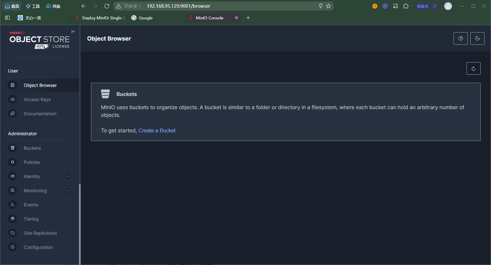

参考：https://min.io/docs/minio/container/operations/installation.html

## Docker单节点单磁盘部署

1.拉取镜像

`docker pull quay.io/minio/minio:RELEASE.2024-01-28T22-35-53Z`

使用docker标签给minio镜像设置一个简短的别名

`docker tag quay.io/minio/minio:RELEASE.2024-01-28T22-35-53Z minio:2024`

`docker rmi quay.io/minio/minio:RELEASE.2024-01-28T22-35-53Z`

2.创建一个minio环境变量文件

`vim /docker/minio/config.env`

```
# MINIO_ROOT_USER and MINIO_ROOT_PASSWORD sets the root account for the MinIO server.
# This user has unrestricted permissions to perform S3 and administrative API operations on any resource in the deployment.
# Omit to use the default values 'minioadmin:minioadmin'.
# MinIO recommends setting non-default values as a best practice, regardless of environment

# 用户名,至少3个字符
MINIO_ROOT_USER=minioadmin
# 密码,至少8个字符
MINIO_ROOT_PASSWORD=minioadmin

# MINIO_VOLUMES sets the storage volume or path to use for the MinIO server.

MINIO_VOLUMES="/docker/minio/data"

# MINIO_OPTS sets any additional commandline options to pass to the MinIO server.
# For example, `--console-address :9001` sets the MinIO Console listen port
MINIO_OPTS="--console-address :9001"
```

2.创建镜像

```sh
docker create                                   \
  -p 9000:9000 -p 9001:9001                     \
  -v /docker/minio/data:/mnt/data               \
  -v /docker/minio/config.env:/etc/config.env   \
  -e "MINIO_CONFIG_ENV_FILE=/etc/config.env"    \
  --name "minio"                                \
  minio:2024 server --console-address ":9001"
```

可选，设置minio容器自动重启

`docker update minio --restart=always`

3.启动容器

`docker start minio`

4.验证启动

`docker logs minio`

MinIO控制台URL：http://IP:9001/

MinIO API URL: http://IP:9000



## Docker单节点多磁盘部署


## Dcoker多节点多磁盘部署


## MinIO客户端

https://min.io/docs/minio/linux/reference/minio-mc.html#mc-install

可以选择在Docker Host上单独安装MinIO客户端工具mc。

Linux：

```sh
curl https://dl.min.io/client/mc/release/linux-amd64/mc \
   --create-dirs \
   -o /docker/minio/bin/mc

chmod +x /docker/minio/bin/mc

export PATH=$PATH:/docker/minio/bin/

mc --help
```

